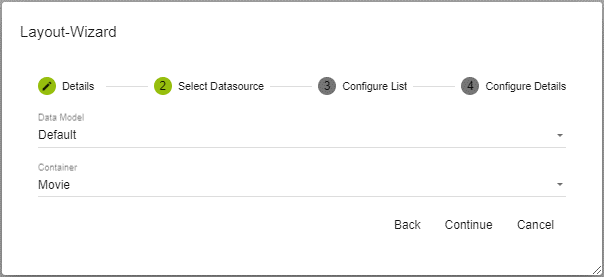

---
sidebar_position: 1
---
##### **Empty Page**
Create a, blank page that can be constructed according to your preferences
##### **Copy Page**
A standalone copy of an existing page, any changes implemented will not be mirrored into the original page.
##### **List Detail**
A template for a page that already has a data table so you can see and update or delete the data. A data source must be selected before page creation. 

List Detail is a page that contains a list box control for display and input fields that allow you to change or add new data points to the table.

Select the desired Data Model and Container which in return will return the desired/designated data records.

|**Property**|**Description**|
| :- | :- |
|Display Member|Displays available fields from the selected data objects|
|Extended display|A formula to extend the display member |
|Order|
Sorting in the Listbox, can be one of:

- ASC

- DESC

- None
|
|Multiselect|Makes the user able to select multiple elements|
|DisableAutoLoad|Deactivate automatic filling in the Listbox when the page is called|
|ShowFilter|Allow filter possibility in the Listbox|
|Grow|The default height and width available in the parent control When activated, size of elements and grows with the number of elements|

|**Property**|**Description**|
| :- | :- |
|⋮|Adjust the order of the fields by dragging and dropping them in the desired placement|
|Visible|Visibility of the controls|
|Type|Definition of the control types which is made available for use by the relevant member. Only control types that correspond to the data type are offered|

##### **Table Detail**

The Table Detail page consists of a table control for displaying data and an input option for entering new data.

` `

The appropriate data model and container need to be chosen to display and store the relevant data records. 

|**Property**|**Description**|
| :- | :- |
|Paging Type|How pages are linked together/ ended|
|Page Size|Amount of pages wanted to be linked together|
|Select Mode|Allows the user to change selection mode for the data table|
|Line Height|Adjust page size using integer values|
|Use Caching|Use caching for data display|
|Columns Reorderable|The user can rearrange the columns|
|Column Resizable|The user can resize columns|
|Disable Auto Load|Deactivate automatic filling when the page is called|
|Columns|Selecting and defining the available columns|
|Fixed Columns|Definition of fixed columns in integers|
|Styles|Style definition for table|

|**Property**|**Description**|
| :- | :- |
|⋮|Adjust the order of the fields by dragging and dropping them in the desired placement|
|Visible|Visibility of the controls|
|Type|Defining the input control type relative to the data field type|

