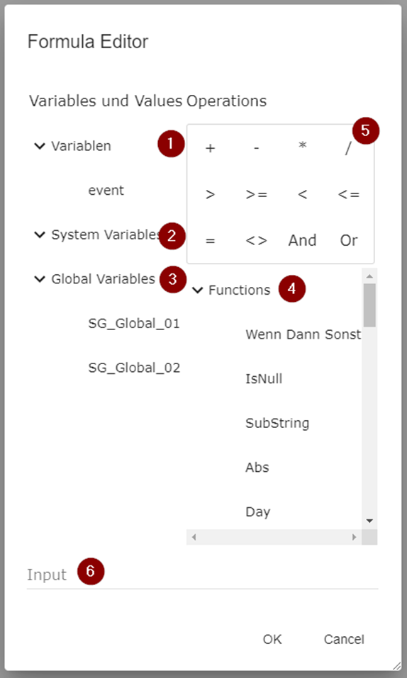

# Formula Editor

The formula editor is used for defining formulas which can be either logical, mathematical, or text comparison. Values can be used as character strings using the toJSON() function in the formula editor. When you want to use a string text you must enter it inside a quotation mark.

Translate() can be used to translate messages by accessing the key from Settings - Settings - Translations here.

| Property | Description                                                                                                              |
| -------- | ------------------------------------------------------------------------------------------------------------------------ |
| 1        | Workflow Variables, mostly status values                                                                                 |
| 2        | System variables, General variables of the corresponding area                                                            |
| 3        | The list of all global variables that are predefined. For further reading [click here](../Global-Variables.md).          |
| 4        | System functions to use in the formula                                                                                   |
| 5        | Logical and mathematical operators to use in the formula                                                                 |
| 6        | Definition of the formula, red text indicates an incorrect syntax for the input, green is a correct syntax for the input |

