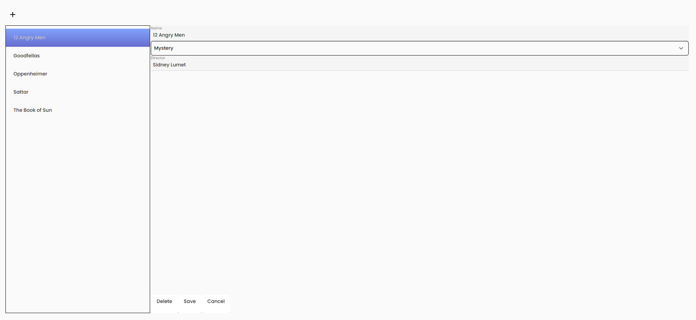
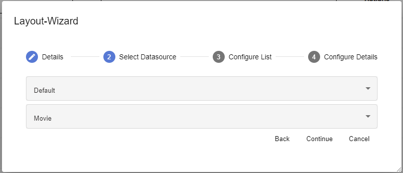
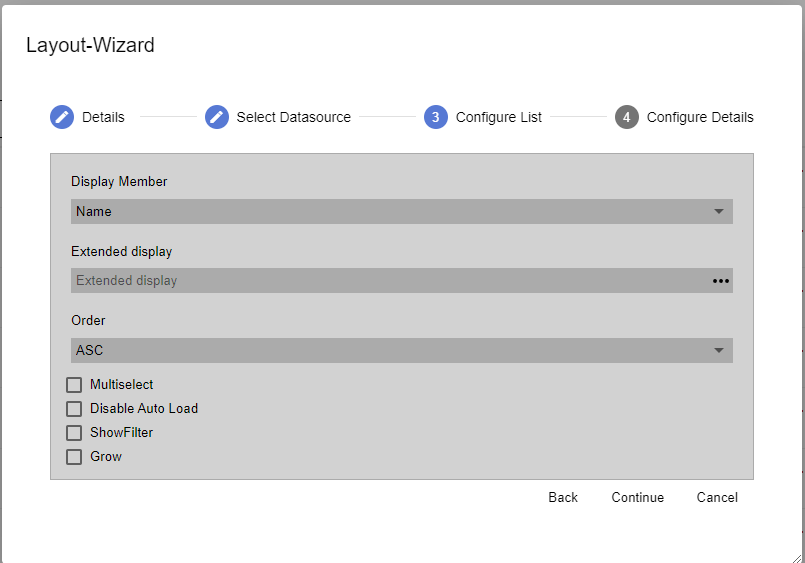
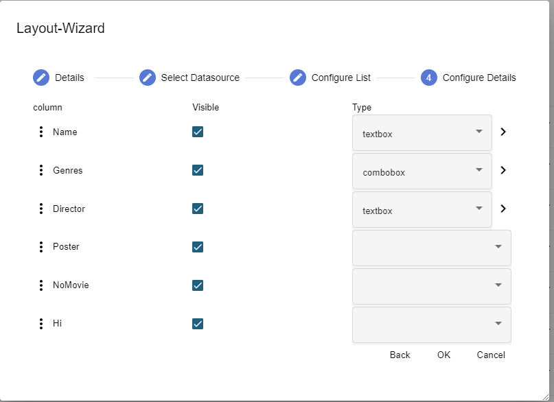

---
sidebar_position: 3
---

# List Detail

A template for a page that already has a data table, allowing you to view, update, or delete the data. A data source must be selected before page creation.

List Detail is a page that contains a list box control for display and input fields that allow you to change or add new data points to the table.

Select the desired Data Model and Container which in return will return the desired/designated data records.

| **Property**     | **Description**                                                                                                                |
| :--------------- | :----------------------------------------------------------------------------------------------------------------------------- |
| Display Member   | Displays available fields from the selected data objects                                                                       |
| Extended display | A formula to extend the display member                                                                                         |
| Order            | 
Sorting in the Listbox, can be one of:

- ASC

- DESC

- None
                                            |
| Multiselect      | Makes the user able to select multiple elements                                                                                |
| DisableAutoLoad  | Deactivate automatic filling in the Listbox when the page is called                                                            |
| ShowFilter       | Allow filter possibility in the Listbox                                                                                        |
| Grow             | When this attribute is checked, the dimensions of the parent (layout) will be adjusted based on the control element dimensions |

| **Property** | **Description**                                                                                                                                         |
| :----------- | :------------------------------------------------------------------------------------------------------------------------------------------------------ |
| ⋮            | Adjust the order of the fields by dragging and dropping them in the desired placement                                                                   |
| Visible      | Visibility of the controls                                                                                                                              |
| Type         | Definition of the control types which is made available for use by the relevant member. Only control types that correspond to the data type are offered |
| >            | Change details which are found in the properties section for the selected type, including placeholder and sorting                                       |
