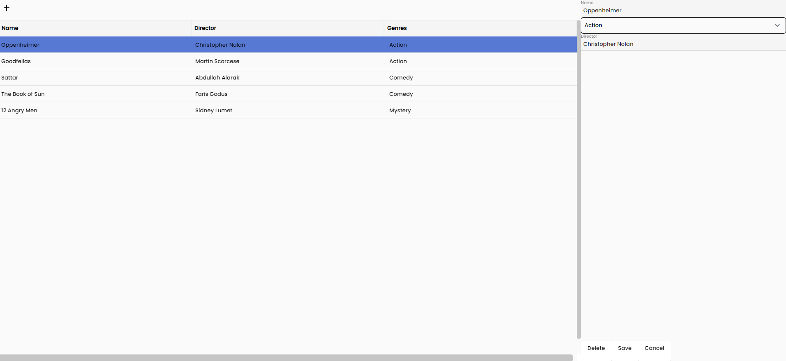
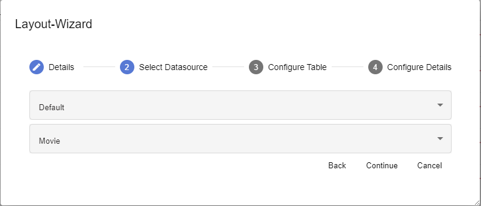
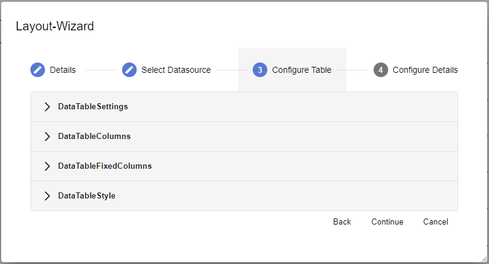
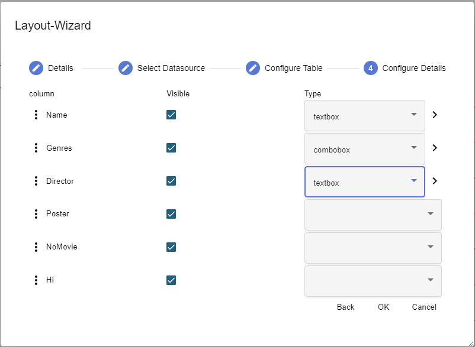

# Table Detail

The Table Detail page consists of a table control for displaying data and an input option for entering new data.

The appropriate data model and container need to be chosen to display and store the relevant data records.

Then the user must select the appropriate settings.

The available properties are:

| **Property**        | **Description**                                             |
| :------------------ | :---------------------------------------------------------- |
| Paging Type         | How pages are linked together/ ended                        |
| Page Size           | Amount of pages wanted to be linked together                |
| Select Mode         | Allows the user to change selection mode for the data table |
| Line Height         | Adjust page size using integer values                       |
| Use Caching         | Use caching for data display                                |
| Columns Reorderable | The user can rearrange the columns                          |
| Column Resizable    | The user can resize columns                                 |
| Disable Auto Load   | Deactivate automatic filling when the page is called        |
| Columns             | Selecting and defining the available columns                |
| Fixed Columns       | Definition of fixed columns in integers                     |
| Styles              | Style definition for table                                  |

The user must then select the members to show.

| **Property** | **Description**                                                                                                   |
| :----------- | :---------------------------------------------------------------------------------------------------------------- |
| ⋮            | Adjust the order of the fields by dragging and dropping them in the desired placement                             |
| Visible      | Visibility of the controls                                                                                        |
| Type         | Defining the input control type relative to the data field type                                                   |
| >            | Change details which are found in the properties section for the selected type, including placeholder and sorting |
