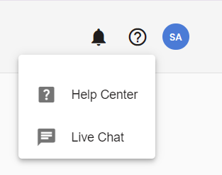
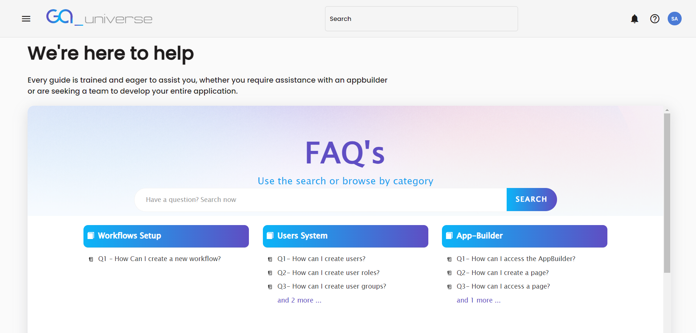
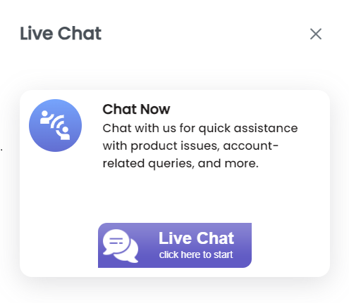

# Help Centre and Chat Accessibility

GA_Universe offers robust support options to assist you with any questions or issues you may encounter. By clicking on the question mark icon, you can easily access the following support features:

### Accessing Support Options
1. **Question Mark Icon:**
- Located in the top-right corner of the interface, click on the question mark icon to reveal support options.
- You will see two available options: Help Centre and Live Chat.

#### Help Centre
**FAQs:** 
- The Help Centre contains a comprehensive list of Frequently Asked Questions (FAQs) that address common issues and queries.
- Browse through different categories or use the search function to find answers to your questions quickly.

2. **Live Chat**
- **Live Chat Accessibility:**
    - If you prefer real-time assistance, select the Live Chat option.
     - You will be prompted to fill in the following details:
        - **Department:** Choose the appropriate department related to your query or issue.
        - **Your Name:** Enter your name to personalize the chat experience.
        - **Email:** Provide your email address for follow-up and record-keeping purposes.
        - **Message:** Describe your issue or question in the message box.
     - Once you’ve filled in the details, click on the Send button to connect with a support representative.

The **Help Centre and Live** Chat features in GA_Universe provide convenient and effective ways to get the support you need. Whether you prefer browsing FAQs or speaking directly with a support representative, these tools are designed to help you resolve any issues efficiently.