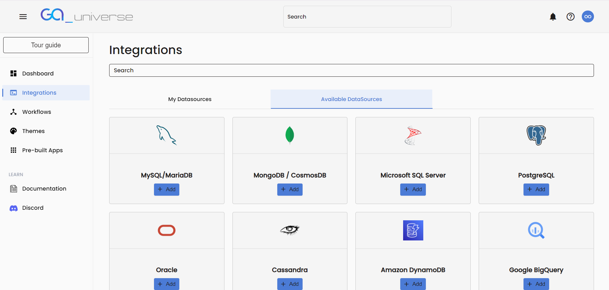

# Integrations

The **Integration** page in GA_Universe allows users to connect to various datasources, enabling seamless data management and integration within your applications.

### Accessing the Integration Page
1. From the Dashboard, click on the Integrations link in the left menu bar.

**Adding a Datasource**
1. On the Integration page, you'll find a list of supported datasources that you can connect to in **Available Datasources Tab**:

- *MySQL / MariaDB*

- *MongoDB / Cosmos DB*

- *Microsoft SQL Server*

- *PostgreSQL*

- *Oracle*

- *Cassandra*

- *Amazon DynamoDB*

- *Google BigQuery*

- *Azure CosmosDB*

- *Couchbase DB*

- *Crate DB*

- *IBM DB2*

- *LiteDB*

- *Microsoft Analysis*

- *ODBC*

- *ROLAP*

- *Speedbase*

2. **To add a datasource:**

- Click the **Add** button next to the desired datasource type.

- A form specific to the selected datasource will appear, prompting you to enter the required details (e.g., hostname, port, username, password, etc.).

3. **Once you have entered the necessary information:**

- Click the **Check Connection** button to verify that the connection can be established.

- If the connection is successful, you can proceed to save the datasource.

4. After saving, the datasource will be added to the **My Datasources** tab.

### Navigating the Integration Page
The Integration page features two main tabs:

**My Datasources:**

- This tab displays all the datasources that you have saved.

- You can manage these datasources, including editing datasources as needed.

**Available Datasources:**

- This tab lists all the supported datasource types that are available for connection.

- From here, you can initiate the process of adding new datasources.