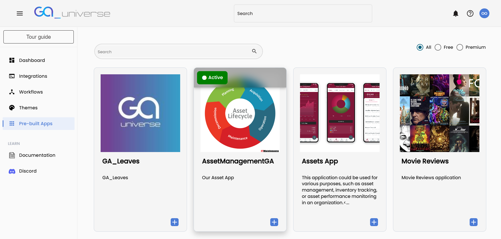

# Pre-Built Apps

The **Pre-built Apps** section in General Admin provides a variety of ready-to-use applications that can be quickly deployed and customized to suit your needs.

### Accessing Pre-built Apps
1. Navigate to the Pre-built Apps page from the landing page by clicking on the Pre-built Apps link.

### Activating an Application
1. Browse through the available pre-built applications on the Pre-built Apps page.

2. To activate an application, click the **Activate button** next to your chosen app.

3. Once activated, you will be redirected to the **Page's** page.

### Launching and Editing an Application
1. To view the activated application, return to the Dashboard and click on the Launch button associated with the application.

2. If you wish to modify the application's navigational structure, click the Edit button. This will allow you to make changes to the app’s layout and flow.

### Editing Application Properties
General Admin also allows you to customize various properties of the pre-built applications. You can edit the following:

- **User Registration Workflow:** Select a User Registration Workflow.

- **Landing Page:** Select a landing page of the application.

- **Default Theme:** Set the default theme for the application.

- **Available Themes:** Select from available themes to change the appearance of your app.

- **CSS Files:** Include CSS files to change the look and feel of the application.

- **Ignore Error Messages:** Error messages will not be displayed in the application.

- **Base Layout:** Modify the overall structure and layout of the application.

- **Login Page:** Customize the design and functionality of the login page.

- **Favicon:** Set a custom favicon for the application.

- **PWA Icon:** Change the Progressive Web App (PWA) icon.

### Delete Pre-built App

You can delete a pre-built app by clicking on delete button. Deleting pre-built app will delete all the associated data.

### Conclusion
With General Admin's Pre-built Apps, you can quickly deploy and customize applications to meet your specific needs.