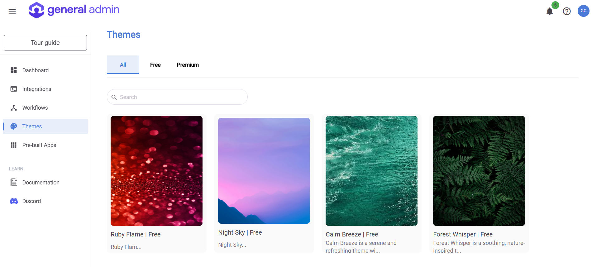

# Themes

The Themes page in General Admin allows you to customize the appearance of your General Admin's application by choosing from a variety of available themes.

### Accessing Themes
Navigate to the Themes page from the landing page by clicking on the Themes link on the left side navigation bar.

### Activating a Theme
- On the **Themes** page, browse through the available themes.

- To apply a theme, simply click on the theme, then click on the **Activate** button.

- Upon activation, you will be redirected to the **Corporate Identity → Themes** page.

- After activating the theme, a pop-up will appear, prompting you to reload the application.

- Click **Reload** to apply all the changes.

- Once refreshed, the new theme will be visible and applied to your application.

 
By following these steps, you can easily personalize your General Admin experience with a theme that suits your preferences. Enjoy exploring the various themes to find the perfect look for your application!

This feature is only available for Premium users.