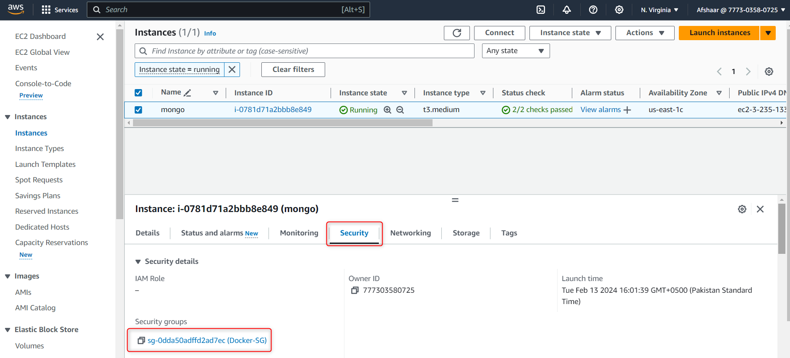
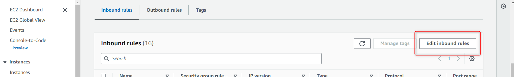
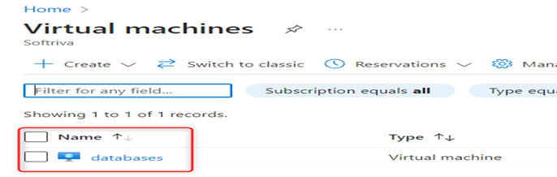
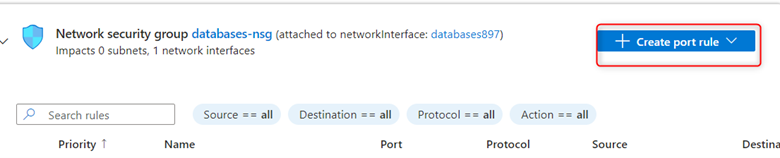
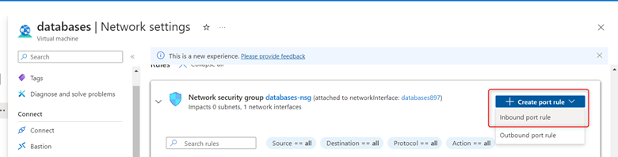
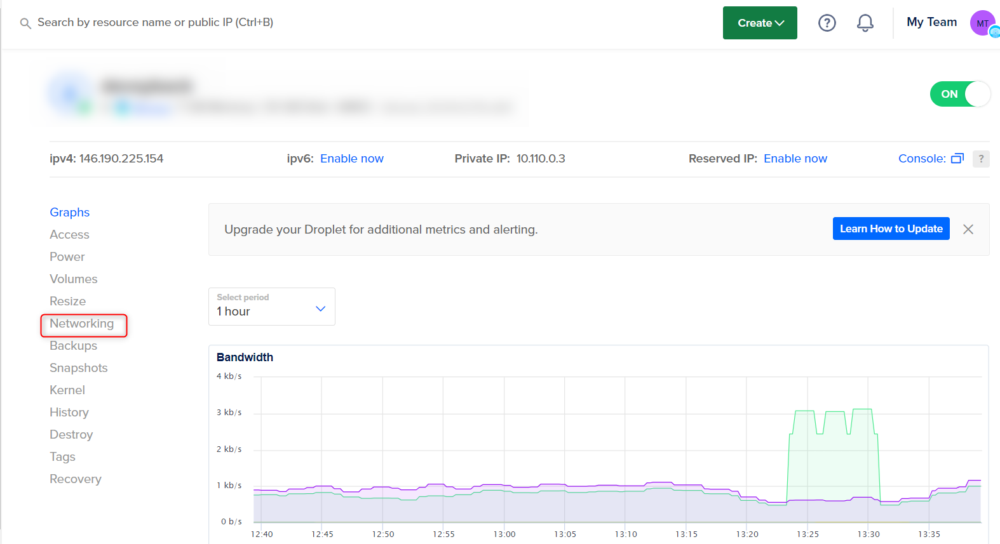
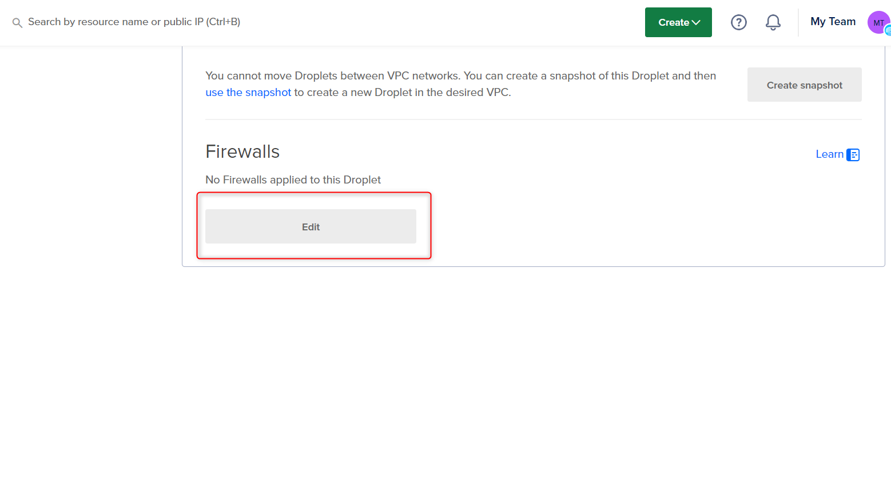

# Docker

You can follow this tutorial to learn how to install GA_Universe with docker.

## Cloud platform

First choose which cloud platform you want to use.

### AWS EC2

Create EC2 on AWS. Follow [this](<https://docs.aws.amazon.com/efs/latest/ug/gs-step-one-create-ec2-resources.html>) guide to learn how.

> **_Note:_** Choose Ubuntu 20.04 as the os

Add the following rules for the security groups: Open ports 8100, 23000, 22000, 24000, 3000, 9005, 6379 to 0.0.0.0. And make sure port 27017 is open to your server IP.

<center>



\

</center>

### Azure VM

You can create a VM in Azure by following [this](<https://www.whizlabs.com/blog/creating-azure-virtual-machine/>) guide.

> **_Note:_** Choose Ubuntu 20.04 as the os and the username should be ubuntu

Add the following rules for the security groups: Open ports 8100, 23000, 22000, 24000, 3000, 9005, 6379 to 0.0.0.0. And make sure port 27017 is open to your server IP.

<center>







</center>

### DigitalOcean

If you prefer to use DigitalOcean, follow [this](<https://docs.digitalocean.com/products/droplets/how-to/create/>) guide to learn how to create an instance.

Make sure to use Ubuntu 20.04 as the os, with 4GB RAM & 2 vCPU.
> **_Note:_** Do not use SSH key while creating, just use password

After the instance is created, Click on the machine then go to networks then click on firewalls and add rules for ports.

Add the following rules for the security groups: Open ports 8100, 23000, 22000, 24000, 3000, 9005, 6379 to All IPV4 & All IPV6. And make sure port 27017 is open to your Server IP.

<center>





</center>

## Setup

After you finish setting up your instance, access it and do the following:

1. Run apt update:

    ```bash
    sudo apt-get update
    ```

2. Follow [this](<https://docs.docker.com/engine/install/ubuntu/>) tutorial to set up docker on ubuntu.

    > **_Note:_** Make sure ports 8100, 23000, 22000, 24000, 3000, 9005, 6379 are open to 0.0.0.0. And make sure 27017 is open to your Server IP.

3. Create a docker compose file

    ```yaml
    version: '3.8'

    services:
    minio:
        image: gauniverse/dev:minio
        command: server /data
        ports:
        - "9005:9000"
        volumes:
        - /home/ubuntu/minio:/data
        environment:
        MINIO_ACCESS_KEY: admin
        MINIO_SECRET_KEY: H7h3c8l3e#
        restart: unless-stopped
        networks:
        - dockerized
        container_name: minio

    mongo:
        image: gauniverse/dev:mongo
        ports:
        - "27017:27017"
        volumes:
        - /home/ubuntu/mongo:/data/db
        restart: unless-stopped
        networks:
        - dockerized
        container_name: mongo

    redis:
        image: gauniverse/dev:redis
        ports:
        - "6379:6379"
        networks:
        - dockerized
        container_name: ubuntu-redis-1

    backend:
        image: gauniverse/dev:myapp-latest-fix
        ports:
        - "22000:22000"
        - "24000:24000"
        networks:
        - dockerized
        container_name: my-app
        volumes:
        - ./user:/app/user:ro
    middle:
        image: gauniverse/dev:middleware-latest-fixed
        ports:
        - "8100:8100"
        networks:
        - dockerized
        container_name: middleware
        entrypoint: ["./startup.sh"]
        volumes:
        - ./user:/app/user:ro
        - ./startup.sh:/app/startup.sh:ro
        command: ["dotnet", "evidanza.MiddleWare.Service.dll"]
    notification:
        image: gauniverse/dev:notification-latest-fix
        ports:
        - "23000:23000"
        networks:
        - dockerized
        container_name: notification_container
        logging:
        driver: "json-file"
        options:
            max-size: "10m"
            max-file: "3"
        entrypoint: ["./startup.sh"]  # Use the modified startup script as the entrypoint
        volumes:
        - ./user:/app/user:ro  # Mount the user file into the container
        - ./startup.sh:/app/startup.sh:ro  # Mount the startup script into the container
        command: ["dotnet", "evidanza.Core.NotificationService.dll"] 
    frontend:
        image: gauniverse/dev:web-fix
        ports:
        - "3000:3000"
        networks:
        - dockerized
        depends_on:
        - backend
        container_name: web
        entrypoint: ["./update-config.sh"]  # Use the modified startup script as the entrypoint
        volumes:
        - ./frontend:/app/frontend:ro  # Mount the user file into the container
        - ./update-config.sh:/app/update-config.sh:ro  # Mount the startup script into the container
        command: ["dotnet", "evidanza.GA.Web.dll"]
    networks:
    dockerized:
        driver: bridge
    ```

4. Create a file named `frontend`

    ``` yaml
    API_BASE_URL: "http://<THE_IP_OF_YOUR_MACHINE>:8100/" 
    WEBSOCKET_URL: "http://<THE_IP_OF_YOUR_MACHINE>:23000/signalr"
    ```

5. Create a file named `user`:

    ``` yaml
    Database=training-meta

    Server=<THE_IP_OF_YOUR_MACHINE>

    Port=27017

    NotificationUrl=<http://<THE_IP_OF_YOUR_MACHINE>:23000>

    Urls=<THE_IP_OF_YOUR_MACHINE>:6379
    ```

    You can optionally add `Username` and `Password` to the user file.

    > **_Note:_** Make sure to create these files in same directory as the docker compose file

6. Create a file named `myapp_startup.sh`

    ```bash
    #!/bin/bash

    # Assuming the user file is in the same directory as the Docker Compose file
    source "$(dirname "$0")/user"

    # Substitute values in the /app/worker/config.json
    sed -i "s|\"Server\": \"mongo\"|\"Server\": \"$Server\"|" /app/worker/config.json
    sed -i "s|\"Database\": \"training-meta\"|\"Database\": \"$Database\"|" /app/worker/config.json
    sed -i "s|\"Port\": \"27017\"|\"Port\": \"$Port\"|" /app/worker/config.json
    sed -i "s|\"Username\": \"\"|\"Username\": \"$Username\"|" /app/worker/config.json
    sed -i "s|\"Password\": \"\"|\"Password\": \"$Password\"|" /app/worker/config.json
    sed -i "s|\"NotificationUrl\": \"http://44.218.244.186:23000\"|\"NotificationUrl\": \"$NotificationUrl\"|" /app/worker/config.json
    sed -i "s|\"44.218.244.186:6379\"|\"$Urls\"|" /app/worker/config.json

    # Substitute values in the /app/scheduler/config.json
    sed -i "s|\"Server\": \"mongo\"|\"Server\": \"$Server\"|" /app/scheduler/config.json
    sed -i "s|\"Database\": \"training-meta\"|\"Database\": \"$Database\"|" /app/scheduler/config.json
    sed -i "s|\"Port\": \"27017\"|\"Port\": \"$Port\"|" /app/scheduler/config.json
    sed -i "s|\"Username\": \"\"|\"Username\": \"$Username\"|" /app/scheduler/config.json
    sed -i "s|\"Password\": \"\"|\"Password\": \"$Password\"|" /app/scheduler/config.json
    sed -i "s|\"NotificationUrl\": \"http://44.218.244.186:23000\"|\"NotificationUrl\": \"$NotificationUrl\"|" /app/scheduler/config.json
    sed -i "s|\"44.218.244.186:6379\"|\"$Urls\"|" /app/scheduler/config.json

    exec "$@"
    ```

    > **_Note:_** Make sure to create these files in same directory as the docker compose file

7. Create a file named `setup.sh`

    ```bash
    #!/bin/bash

    # Clone the repository containing MongoDB dump
    git clone https://github.com/AfshaarAhmed/MongoDB-Dump.git

    # Download MongoDB tools for Debian 11
    wget https://fastdl.mongodb.org/tools/db/mongodb-database-tools-debian11-x86_64-100.9.4.deb

    # Install MongoDB tools
    sudo dpkg -i mongodb-database-tools-debian11-x86_64-100.9.4.deb

    # Move to the MongoDB-Dump directory
    cd MongoDB-Dump

    # Install unzip if not already installed
    sudo apt-get install unzip

    # Unzip the database dump
    unzip dbdump.zip

    # Restore the MongoDB database from the dump
    mongorestore --host=localhost:27017 --db training-meta --gzip training-meta/
    ```

8. Create a file named `start.sh`

    ```bash
    #!/bin/bash

    # Assuming the frontend directory is in the same directory as the Docker Compose file
    frontend_dir="$(dirname "$0")/frontend"

    # Path to the config.json file
    config_file="/app/app/assets/config.json"

    # Create the target directory if it doesn't exist
    mkdir -p "$(dirname "$config_file")"

    # Replace config.json in the container with the contents of the frontend directory
    cp -r "$frontend_dir"/* "$config_file"

    # Remove old config.json
    rm -rf "$frontend_dir"

    # Execute the specified command (e.g., starting your web application)
    exec "$@"
    ```

9. Create a file named `startup.sh`

    ```bash
    #!/bin/bash
    # Assuming the user file is in the same directory as the Docker Compose file
    source "$(dirname "$0")/user"

    # Substitute values in the config.json
    sed -i "s/\"Server\": \"mongo\"/\"Server\": \"$Server\"/" /app/config.json
    sed -i "s/\"Database\": \"training-meta\"/\"Database\": \"$Database\"/" /app/config.json
    sed -i "s/\"Port\": \"27017\"/\"Port\": \"$Port\"/" /app/config.json
    sed -i "s/\"Username\": \"\"/\"Username\": \"$Username\"/" /app/config.json
    sed -i "s/\"Password\": \"\"/\"Password\": \"$Password\"/" /app/config.json
    sed -i "s|\"NotificationUrl\": \"http://44.218.244.186:23000\"|\"NotificationUrl\": \"$NotificationUrl\"|" /app/config.json
    sed -i "s|\"44.218.244.186:6379\"|\"$Urls\"|" /app/config.json

    exec "$@"
    ```

10. Create a file named `update-config.sh`

    ```bash
    #!/bin/bash

    # Assuming the frontend file is in the same directory as the Docker Compose file
    frontend_file="$(dirname "$0")/frontend"

    # Read the variables from the frontend file
    while IFS= read -r line; do
        if [[ $line =~ ^([A-Za-z_]+):[[:space:]]*\"([^\"]*)\"$ ]]; then
            key="${BASH_REMATCH[1]}"
            value="${BASH_REMATCH[2]}"
            declare "$key=$value"
        fi
    done < "$frontend_file"

    # Debugging output
    echo "API_BASE_URL before substitution: $API_BASE_URL"
    echo "WEBSOCKET_URL before substitution: $WEBSOCKET_URL"

    # Escape special characters in API_BASE_URL and WEBSOCKET_URL
    API_BASE_URL=$(sed 's/[\*\.&]/\\&/g' <<< "$API_BASE_URL")
    WEBSOCKET_URL=$(sed 's/[\*\.&]/\\&/g' <<< "$WEBSOCKET_URL")

    # Substitute values in the app/assets/config.json
    sed -i "s|\"API_BASE_URL\": \".*\"|\"API_BASE_URL\": \"$API_BASE_URL\"|" /app/app/assets/config.json
    sed -i "s|\"WEBSOCKET_URL\": \".*\"|\"WEBSOCKET_URL\": \"$WEBSOCKET_URL\"|" /app/app/assets/config.json

    # Execute the specified command (e.g., starting your web application)
    exec "$@"
    ```

11. Then Run the following command in the terminal:

    ```bash
    docker login  
    ```

    and use `gauniverse` as the username, and `Qmobilea34@` as the password.

12. Then run:

    ```bash
    sudo chmod +x myapp_startup.sh start.sh startup.sh update-config.sh setup.sh  
    docker compose up -d ; ./setup.sh
    ```

13. Set the up MinIO:

    Use the following MinIO credentials for the mediasources and login in GA  

    ```Text
    Username: admin

    Password: H7h3c8l3e#

    Port: 9005

    URL: <THE_IP_OF_YOUR_MACHINE>
    ```

14. Access the instance:
    Use the following Login Credentials to login into the GA_Universe:

    ```Text
    Username: Admin
    Password: Admin@1234
    ```

    > **_Note:_** You can access the instance via the same machine IP and port 3000

## Troubleshooting

If you encounter issues after installing GA, such as 404 errors or a white screen, run the following commands in the specified order to restart the Docker containers:

```bash
sudo docker restart middleware

sudo docker restart notification_container

sudo docker restart my-app

sudo docker restart web
```
