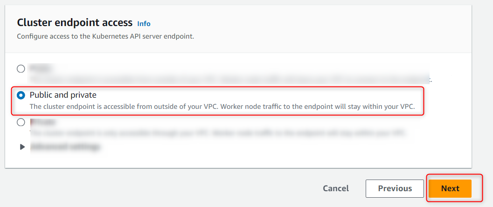
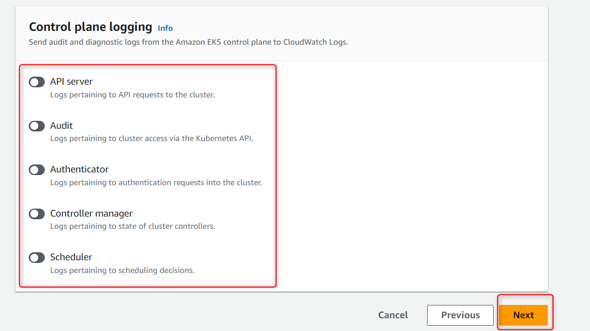

# AWS (EKS Cluster)

Amazon EKS simplifies the process of running Kubernetes on AWS by taking care of the underlying infrastructure and allowing users to focus on deploying and managing their applications.

## Prerequisites

Before launching an EKS service, you need to have an AWS subscription and have the AWS CLI installed on your machine:

- [AWS Subscription](https://aws.amazon.com/)
- [AWS CLI](https://docs.aws.amazon.com/cli/latest/userguide/getting-started-install.html)

## How to Create an EKS Cluster

1. Search the EKS in the Search Bar
2. Click on “Elastic Kubernetes Service” to open the service

3. Click on the dropdown ‘Add Cluster’ button and then select ‘Create button’ to create the cluster

4. Perform the following steps:
    - Enter the name of your cluster
    - Select the Kubernetes version 1.26.6
    - Create your Cluster Service role by using the [Amazon EKS User Guide](https://docs.aws.amazon.com/eks/latest/userguide/service_IAM_role.html#create-service-role) and select it

5. Now next step is to create the VPC, do the following steps:
    - Create the [VPC](https://docs.aws.amazon.com/vpc/latest/userguide/create-vpc.html)
        - Select the created VPC from dropdown by clicking on the refresh button
    - Create the [Subnets](https://docs.aws.amazon.com/vpc/latest/userguide/create-subnets.html)
        - Select the created Subnets from dropdown by clicking on the refresh button
    - Create the [Security Groups](https://docs.aws.amazon.com/cli/latest/userguide/cli-services-ec2-sg.html#creating-a-security-group)
        - Select the created Security Groups from dropdown by clicking on the refresh button

6. Select Public and private as Cluster Endpoint Access

AND

Click Next Button

7. Select Prometheus (optional)

8. Turn on the logs if required (optional)

> **_Note:_** Wait for 10 - 15 minutes in order to see the created cluster.

## EKS Kubernetes Deployment

- [Configuring the EKS Kubernetes Deployment](./EKS-Kubernetes-Deployment)
