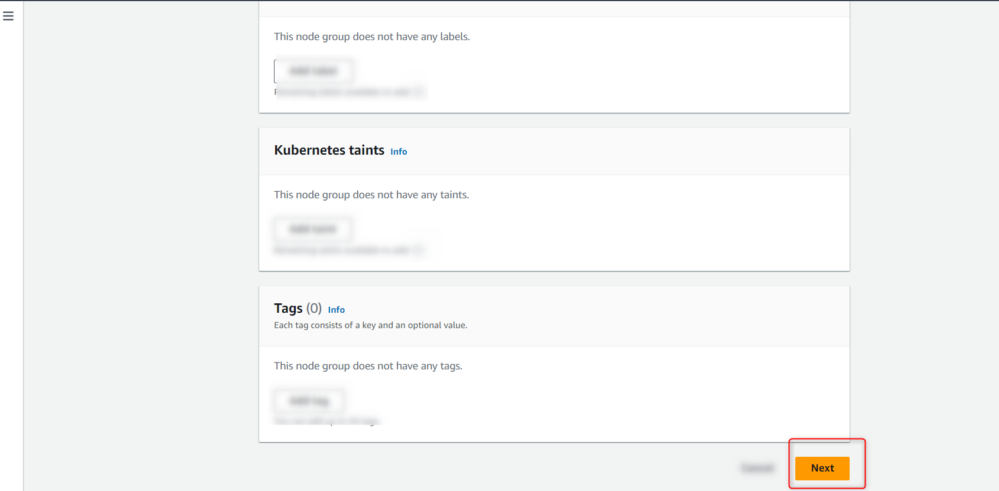

# EKS Kubernetes Deployment

Here is the step-by-step guide that will help you to deploy GA Universe on Elastic Kubernetes Service (EKS).

## Add Node Group in EKS Cluster

1. Search the created EKS Cluster in the search bar
    1. Select the Compute Tab
    2. Click on “Add node group”


2. To configure the node group, do the following steps:
    1. Enter the name of the Node Group
    2. Select the IAM role from the drop down (click on [IAM console](https://docs.aws.amazon.com/eks/latest/userguide/create-node-role.html) to create IAM role)




3. Select the Amazon Linux 2 (AL2_x86_64) as an AMI type
    1. Select T3 medium and specify the Disk Size (50 GB minimum)
    2. Enter the node, min and max size (size should be greater than 1)


4. Select subnets (To create [Subnet](https://ap-southeast-1.console.aws.amazon.com/vpcconsole/home?region=ap-southeast-1#subnets))


## Steps to Create a Volume

All the data from MongoDB and MinIO will be stored in the volume.

1. Go to your AWS Services account and search Volumes (EC2 feature)


2. Perform the following steps to complete the volume creation:
    - Select Volume type as gp3. (The user can also select gp2, but gp3 is preferred)
    - Enter the size of your required volume (minimum 20)


## Configure the Volume and Node to YAML FILES

1. Generate YAML Files

To generate YAML files, you need install the following services.

- Docker Installation
- Dotnet Installation

After successfully installing above two services, you need to clone the YAML generator by using this command.

``` bash
git clone https://github.com/arsumelahi21/self-hosting-files.git
```

&

then Run the “YAMLgenerator.exe” as an Administration


### Following input will be required

> **_Note:_** We are using the Babakom images just for testing purposes, we will replace with the original images when the code development will be completed.

- Generate GitHub credentials? (y/n)

``` bash
n
```

- Please enter domain.

``` bash
<your domain name>
```

- Please enter namespace:

``` bash
<your space name>
```

- d. Please enter service image:

``` bash
babakomregistry.azurecr.io/bk-middleware-services:v1.0  
```

- Please enter web image:

``` bash
babakomregistry.azurecr.io/bk-web-services:v1.0
```

- Please enter notification image:

``` bash
babakomregistry.azurecr.io/bk-notification-services:v1.0
```

- Please enter schedular image:

``` bash
babakomregistry.azurecr.io/bk-scheduler-services:v1.0
```

- Please enter worker image:

``` bash
babakomregistry.azurecr.io/bk-worker-services:v1.0
```

All these commands will generate the Result folder inside the Executable folder containing YML files.

2. Add Volume to MinIO

- Open the generated Result folder, select miniodeployment.yaml file and change its claimname to “my-pvc“


- Create a new file with name of minionewpvc.yaml in the result folder and add the following code:

``` bash
apiVersion: v1
kind: PersistentVolumeClaim
metadata:
  name: my-pvc
spec:
  accessModes:

ReadWriteOnce

  resources:
    requests:
      storage: 10Gi  # Specify the storage size you need
  storageClassName: ""  # Use appropriate storage class if needed
```

- Create another file with name of minionewpv.yaml in the result folder and add the following code:

```bash
apiVersion: v1
kind: PersistentVolume
metadata:
  name: my-ebs-volume
spec:
  capacity:
    storage: 10Gi  # Specify the desired storage capacity
  accessModes:

ReadWriteOnce

  awsElasticBlockStore:
    volumeID: vol-01d0179c407e9c6da  # Replace with the the created volume ID
    fsType: ext4  # Specify the filesystem type
```

> **_Note:_** Don’t forget to replace the volumeID with your created volume ID.

- Select your created Volume and copy the Volume ID as shown in the image below


3. Add Volume to MongoDB

- Create a new Volume for MongoDB and copy its ID as we did before
- Go to mongostateful.yaml file in the result folder and then replace claimname with “my-pvc1“


- Create a new file named mongonewpv.yaml file and add the following code

``` bash
apiVersion: v1
kind: PersistentVolume
metadata:
  name: my-ebs-volume1
spec:
  capacity:
    storage: 10Gi  # Specify the desired storage capacity
  accessModes:

ReadWriteOnce

  awsElasticBlockStore:
    volumeID: vol-045d0587f7652aeb8  # Replace with the created volume ID
    fsType: ext4  # Specify the filesystem type
```

> **_Note:_**: Replace the volumeID with the MongoVolume created ID.

- Create a new file with the name of mongonewpvc.yaml file and add the following code

```bash
apiVersion: v1
kind: PersistentVolumeClaim
metadata:
  name: my-pvc1
spec:
  accessModes:

ReadWriteOnce

  resources:
    requests:
      storage: 10Gi  # Specify the storage size you need
  storageClassName: ""  # Use appropriate storage class if needed
```

4. Deploy the created YAML Files

Run any of cmd, Powershell or gitbash in the created Result folder

and

Execute the following command.

```bash
aws configure
```

- Enter the Access key ID (if not created click [here](https://docs.aws.amazon.com/IAM/latest/UserGuide/id_credentials_access-keys.html#Using_CreateAccessKey))
- Enter the Secret Access Key

- Enter the default region name. This region would be the one that was used while creating EKS Cluster. This is [how](https://docs.aws.amazon.com/awsconsolehelpdocs/latest/gsg/select-region.html) you can choose your region in AWS


Use these commands to connect with EKS cluster to the local machine

```bash
aws eks --region <your region> update-kubeconfig --name <you cluster name>
```

```bash
kubectl create secret docker-registry regcred \
  --docker-server=babakomregistry.azurecr.io \
  --docker-username=babakomregistry \
  --docker-password=cn3PYoHOc4DhNG0ppW0pUp7XgrbPXtrzdRkVFjIQD3+ACRA2/Bdc \
  --docker-email=<your email> \ 
  -n <namespace>
```

> **_Note:_** Please ensure that your namespace, as already mentioned in the YAML generator, remains the same.

- Now deploy each YAML file using the following commands:

```bash
kubectl apply -f namespace.yml
```

```bash
kubectl apply -f <your yaml file name> -n <your namespace>
```

> **_Note:_** Please write the names of all the yml files, that are present in the Result folder except mongopv.yaml and miniopv.yaml

5. Install NGINX Ingress Controller

In cmd, powershell, or bash, deploy NGINX Ingress Controller to your cluster by running the following command:

```bash
kubectl apply -f https://raw.githubusercontent.com/kubernetes/ingress-nginx/controller-v1.8.2/deploy/static/provider/cloud/deploy.yaml
```

6. Enable SSL with Cert-Manager (if you want the SSL to be implemented on your domain)
    - To enable SSL for your AKS cluster you can get help from [Cert-Manager Installation Documentation](https://cert-manager.io/docs/installation/)

7. Connect Domain to Ingress

You can obtain the IP by running the command:

```bash
kubectl get ingresses
```


## Configure IP to the Domain Server

> **_Note:_** To connect IP, to the domain server, we are using GoDaddy as an example. You can also choose other domain registry websites such as Namecheap, Bluehost, HostGator, etc.

1. Login to your domain registry website, or create an account if you don’t have one


2. Click on DNS and then Add New Record button


3. Now choose the type as CNAME


4. Now enter the Ingress Domain and the IP and click on Save button


>**_Note:_** Open the web domain in your browser, and you will be able to successfully load the GA Universe. In our case it’s <http://www.gauniv.com>
