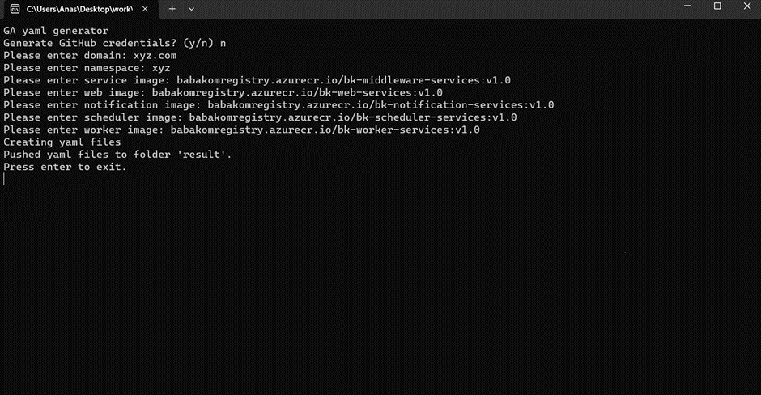
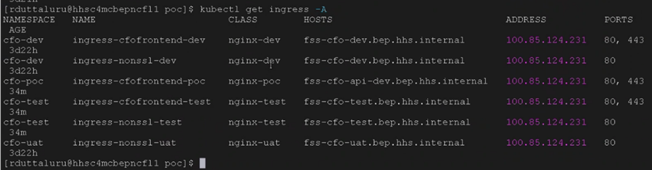
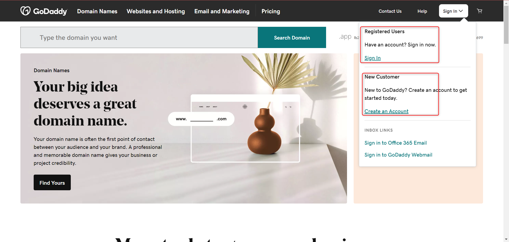
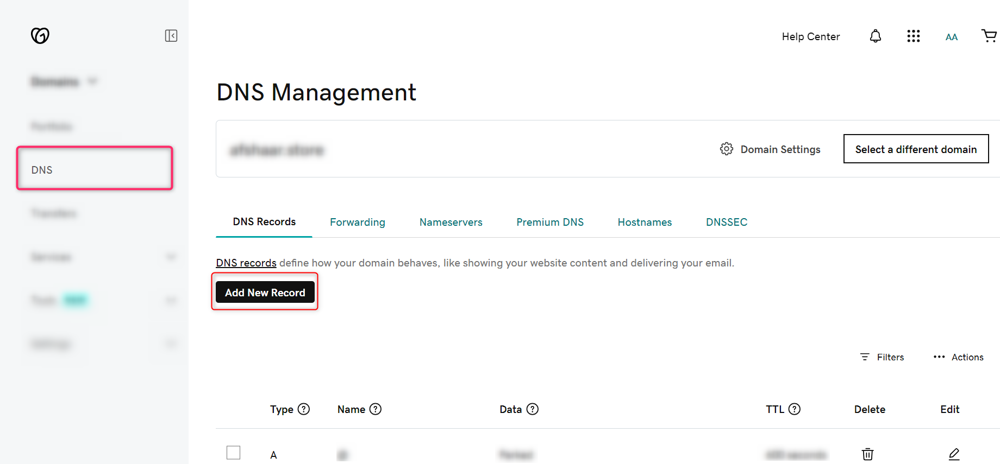
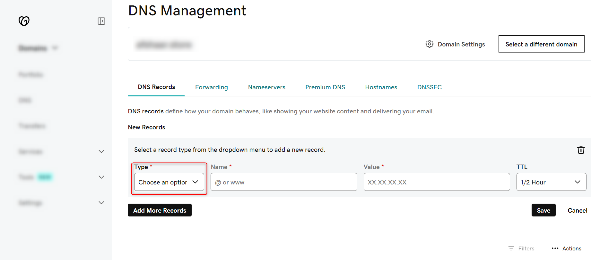
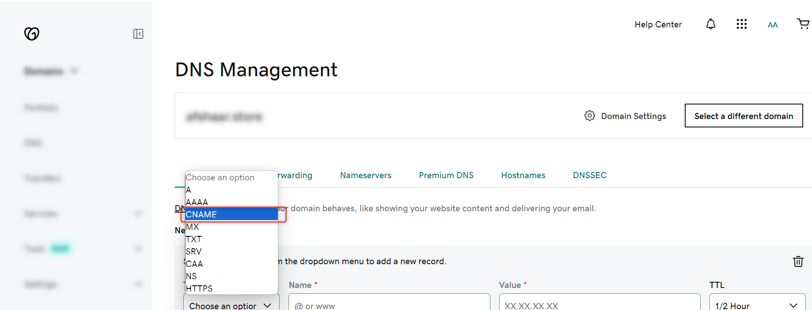
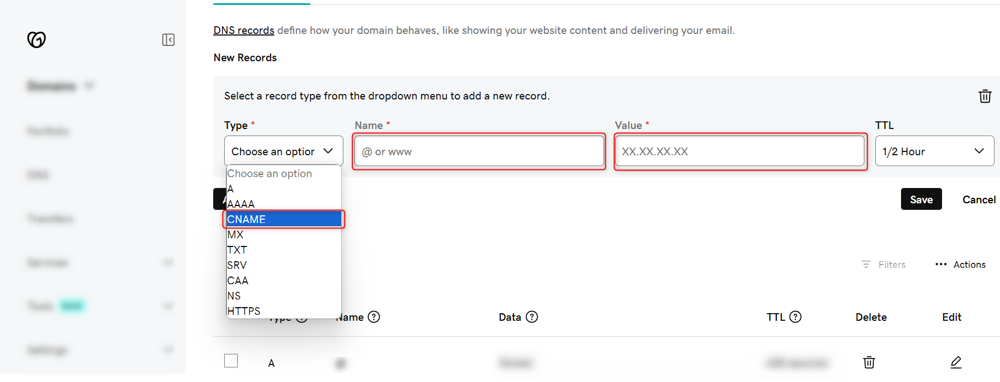

# AKS Kubernetes Deployment

Here is the step by step guide that will help you to deploy GA Universe on Azure Kubernetes Service (AKS).

### Generate YAML Files

To generate YAML files, you need install the following services

- [Docker Installation](https://docs.docker.com/desktop/install/windows-install/)
- [Dotnet Installation](https://learn.microsoft.com/en-us/dotnet/core/install/windows?tabs=net80)

After successfully installing above two services,  you need to clone the YAML generator by using this command:

> git clone <https://github.com/arsumelahi21/self-hosting-files.git>

&

then Run the “YAMLgenerator.exe” as an Administration



#### Following input will be required

> **_NOTE:_** We are using the Babakom images just for testing purposes, we will replace with the original images when the code development will be completed.

- Generate GitHub credentials? (y/n):

``` bash
    n
```

- Please enter domain:

``` bash
    <your domain name>
```

- Please enter namespace:

``` bash
    <your domain name>
```

- Please enter service image:

``` bash
    babakomregistry.azurecr.io/bk-middleware-services:v1.0  
```

- Please enter web image:

``` bash
    babakomregistry.azurecr.io/bk-web-services:v1.0
```

- Please enter notification image:

``` bash
    babakomregistry.azurecr.io/bk-notification-services:v1.0
```

- Please enter schedular image:

``` bash
    babakomregistry.azurecr.io/bk-scheduler-services:v1.0
```

- Please enter worker image:

``` bash
    babakomregistry.azurecr.io/bk-worker-services:v1.0
```

All these commands will generate the Result folder inside the Executable folder containing YML files.

#### Deploy the created YAML Files

Run any of cmd, Powershell or gitbash in the created Result folder

and

Execute the following commands:

> Ensuring the AKS Cluster is connected with the local system

``` bash
kubectl get deployments --all-namespaces=true
```

``` bash
kubectl create secret docker-registry regcred \
--docker-server=babakomregistry.azurecr.io \
--docker-username=babakomregistry \
--docker-password=cn3PYoHOc4DhNG0ppW0pUp7XgrbPXtrzdRkVFjIQD3+ACRA2/Bdc \
--docker-email=<your email> \
-n <namespace >
```

> **_Note:_** Please ensure that your namespace, as already mentioned in the YAML generator, remain the same.

#### Now deploy each YAML file using the following commands

``` bash
kubectl apply -f namespace.yml
```

``` bash
kubectl config set-context --current --namespace=<namespace>
```

``` bash
kubectl apply -f <your yaml file name> -n <your namespace>
```

> **_Note:_** Please write the names of all the yml files, that are present in the Result folder.

#### Install NGINX Ingress Controller

In cmd, powershell, or bash, deploy NGINX Ingress Controller to your cluster by running the following command:

``` bash
kubectl apply -f https://raw.githubusercontent.com/kubernetes/ingress-nginx/controller-v1.8.2/deploy/static/provider/cloud/deploy.yaml
```

#### Enable SSL with Cert-Manager (if you want the SSL to be implemented on your domain)

To enable SSL for your AKS cluster you can get help from [Cert-Manager Installation Documentation.](https://cert-manager.io/docs/installation/)

#### Connect Domain to Ingress

```bash
kubectl get ingresses
```



### Configure IP to the Domain Server

> **_Note:_** To connect IP, to the domain server, we are using GoDaddy as an example. You can also choose other domain registry websites such as Namecheap, Bluehost, HostGator, etc.

#### Login to your domain registry website, or create an account if you don’t have one



#### Click on DNS and then Add New Record button




#### Now choose the type as CNAME





#### Now enter the Ingress Domain and the IP and click on Save button



>**_Note:_** Open the web domain in your browser, and you will be able to successfully load the GA Universe. In our case it’s <http://www.gauniv.com>
