# Microsoft Azure (AKS Cluster)

Azure Kubernetes Service (AKS) offers the quickest way to start developing and deploying cloud-native apps in Azure.

## Prerequisites

Before launching an AKS service, you need to have an Azure subscription and have the Azure CLI installed on your machine:

- [Azure Subscription](https://azure.microsoft.com/en-us/)
- [Azure CLI](https://learn.microsoft.com/en-us/cli/azure/)

## How to Create an AKS Cluster

1. Search the AKS Cluster in the Search Bar

2. Click on “Create a Kubernetes Cluster” to create the cluster

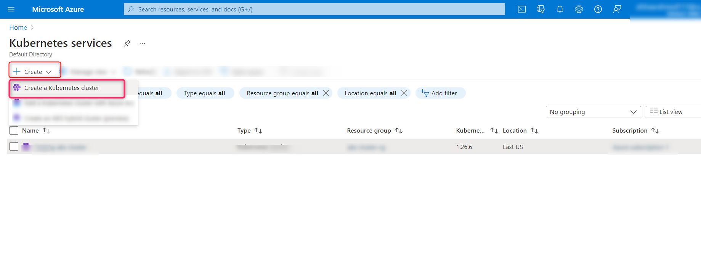

3. Enter all the information in the Basics tab

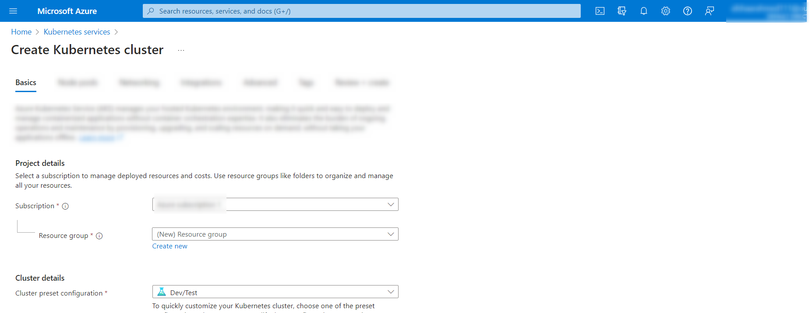

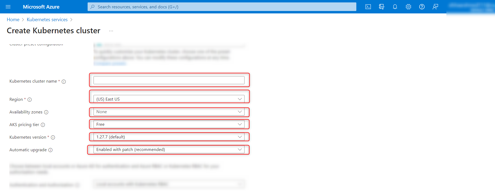

4. Now click on Node Pools tab and then + Add node pool button. Enter all the information and then click on the Update button

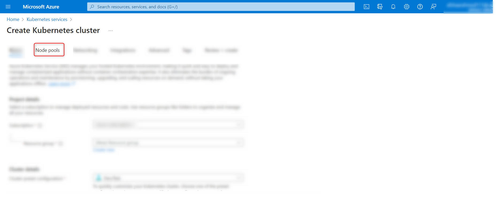

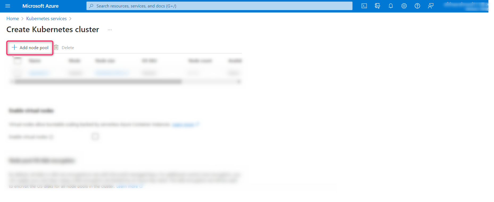

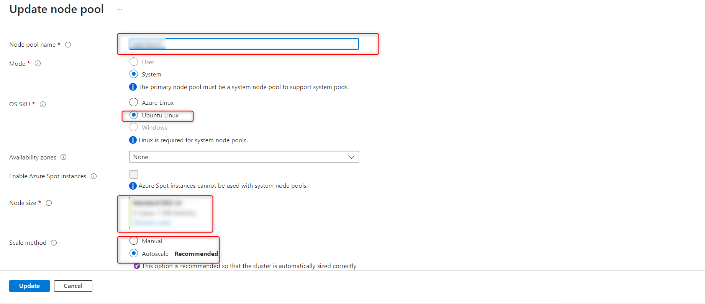

5. Now, click on Networking tab and select Azure CNI in the Network configuration

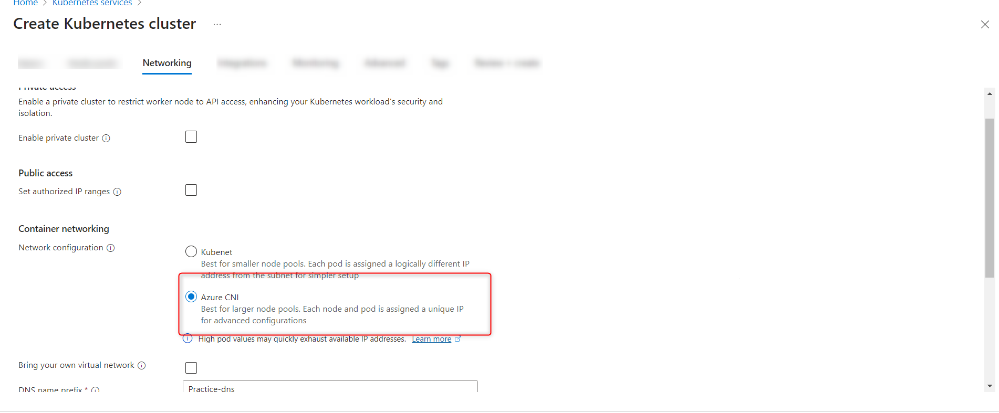

6. Select Azure as Network Policy

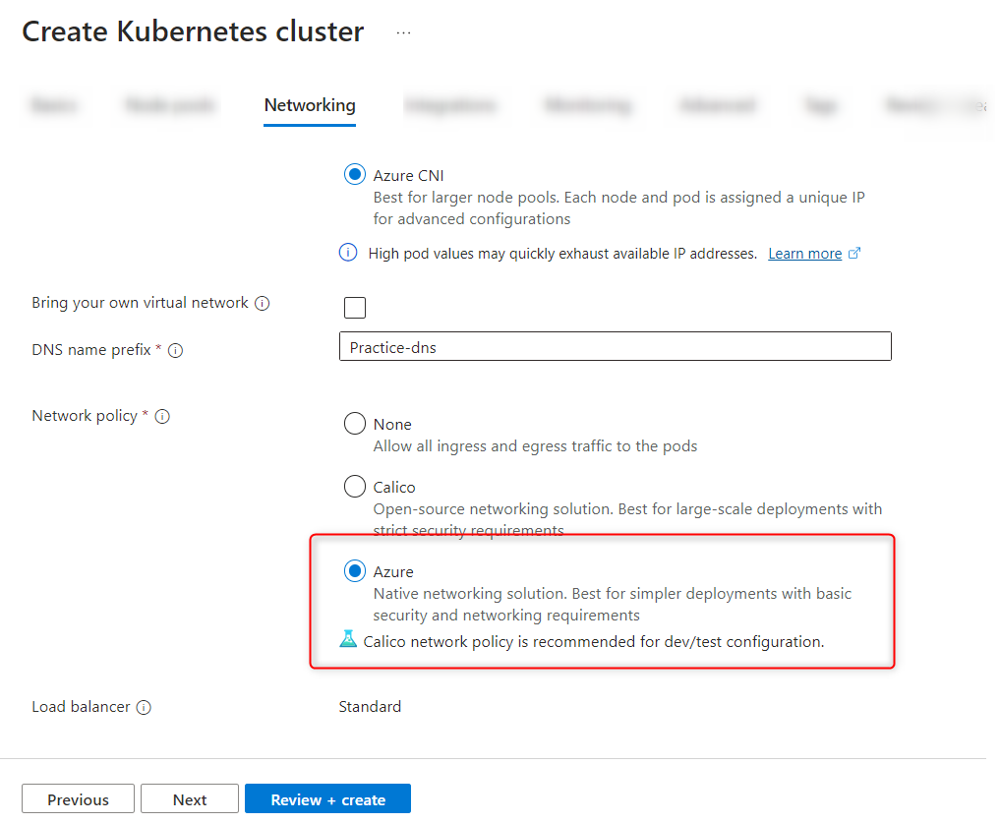

7. Now go to Monitoring tab and Select Default Configuration as the Azure Monitor. Now click on “Review + Create“ button

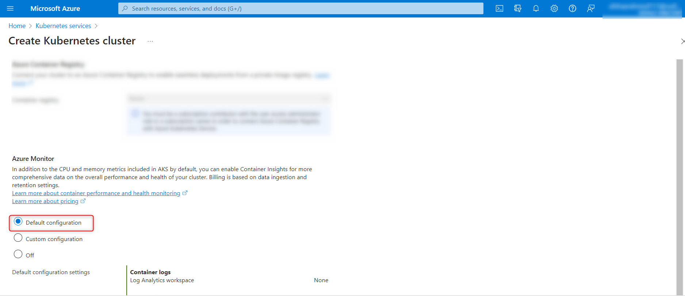

## How to Connect with AKS Cluster

1. Search “AKS” in the search bar and then click on “Kubernetes Service” as mentioned in the image below

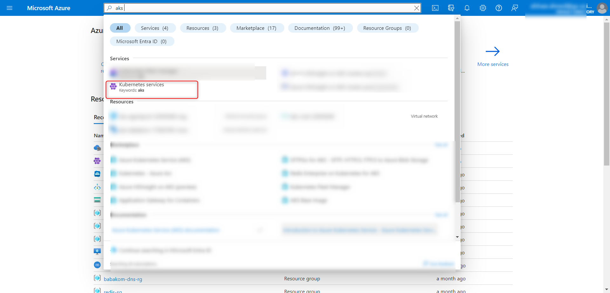

2. Select the desired Kubernetes service and click on the “Connect” button

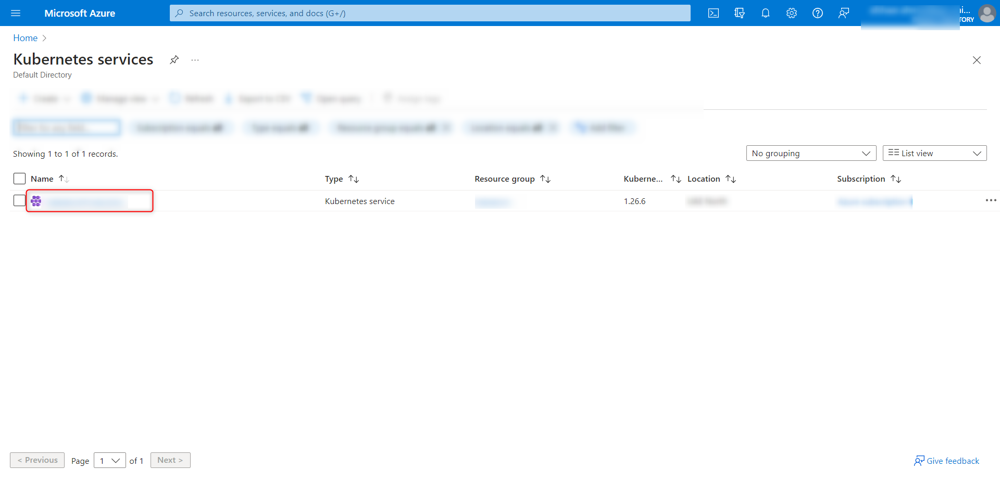

3. Connect to the “Azure CLI” Service

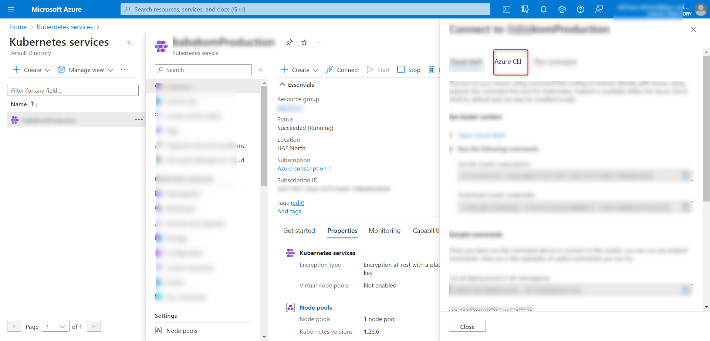

4. Open any of  cmd, Powershell or gitbash and  run the following commands

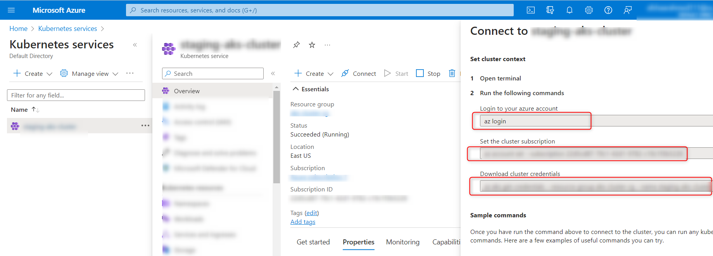

5. Use the below command, to check whether the cluster is connected or not with local machine

    > kubectl get deployments --all-namespaces=true

## AKS Kubernetes Deployment

- [Configuring the AKS Kubernetes Deployment](./AKS-Kubernetes-Deployment)
