# Creating Automated Tests Using the Selenium Web Driver

Welcome to the ultimate guide on automating your testing processes. In this tutorial we are going to explain how to use Java Cucumber BDD Framework using Selenium WebDriver. Here is the step-by-step tutorial.  

## Make sure all the following applications are installed

Make sure all the following applications are installed:

- Download and install [Eclipse](https://eclipseide.org/).

- Download [Selenium WebDriver](https://www.selenium.dev/downloads/) for your Browser. (In this tutorial, we are using Chrome.)

## Creating a Maven Project

1. Open the Eclipse IDE.

2. Click on the File → New → Maven Project.

<center>

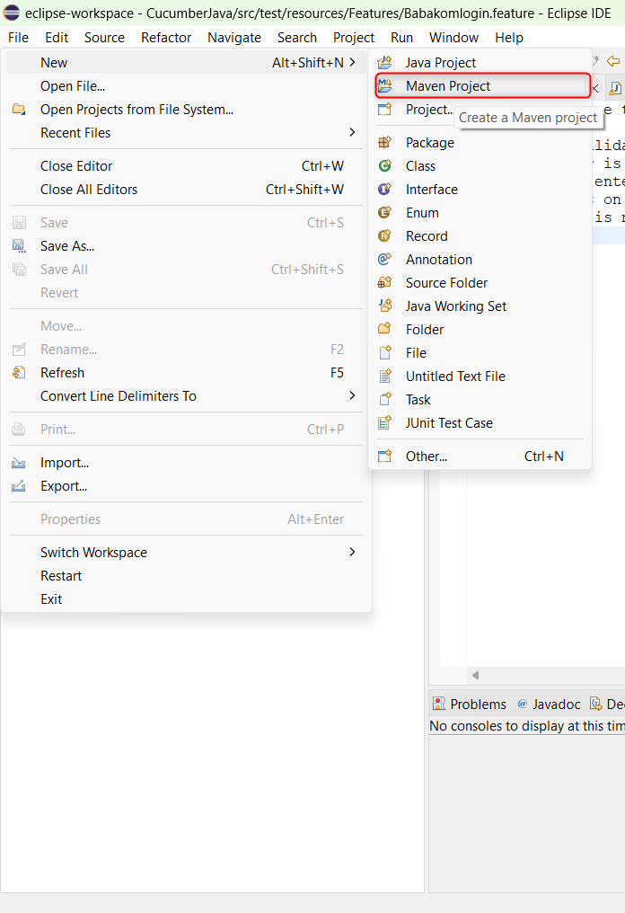

</center>

3. Click on the checkbox of Create a simple project (skip archetype selection) and then Next button.

<center>

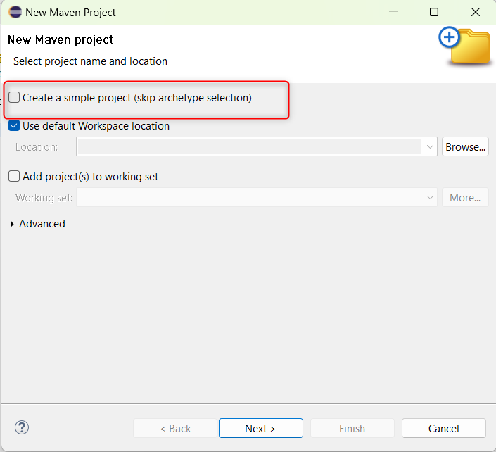

</center>

4. Add the name of your Group ID and Artifact Id and then click on the Finish button.

<center>

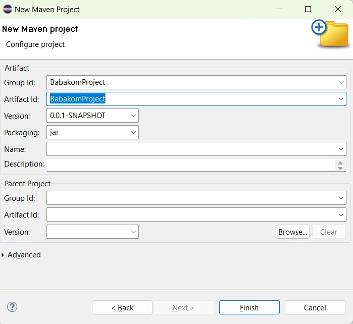

</center>

5. Your Maven project has been created and will look like this.

<center>

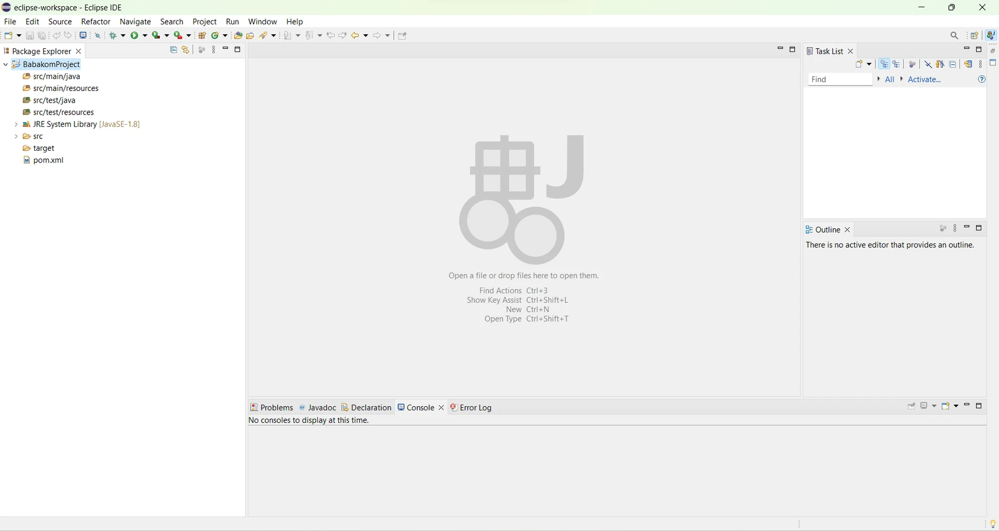

</center>

## Adding Dependencies

### Adding Cucumber JVM

1. Copy the latest JVM dependency from [MavenRepository](https://mvnrepository.com/artifact/io.cucumber/cucumber-java).

2. Go to pom.xml file and add the dependencies tag and paste the Cucumber JVM and click on the save button.

<center>

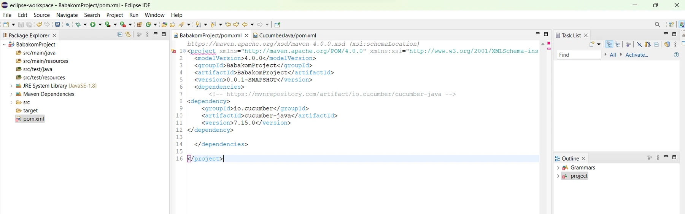

</center>

### Adding JUnit

1. Copy the latest JUnit dependency from [MavenRepository](https://mvnrepository.com/artifact/io.cucumber/cucumber-junit).

2. Go to pom.xml file and paste the JUnit dependency under Cucumber JVM dependency and click on the save button.

### Adding Cucumber JVM JUnit

1. Copy the latest Cucumber JVM JUnit dependency from [MavenRepository](https://mvnrepository.com/artifact/io.cucumber/cucumber-junit).

2. Go to pom.xml file and paste the Cucumber JVM JUnit dependency under JUnit dependency.

### Adding Selenium Java

1. Copy the latest Selenium Java dependency from [MavenRepository](https://mvnrepository.com/artifact/org.seleniumhq.selenium/selenium-java).

2. Go to pom.xml file and paste the Selenium Java dependency under Cucumber JVM dependency.

<center>

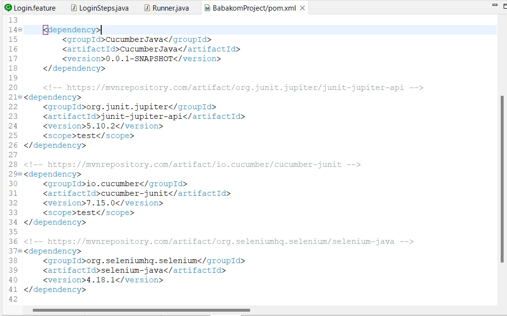

</center>

## Let’s Define Test Steps

1. Now, create a new folder with the name “Babakom Login“ under src/test/resources folder.

<center>

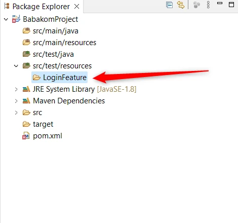

</center>

2. Now, create a Login.feature file under LoginFeature folder.

<center>

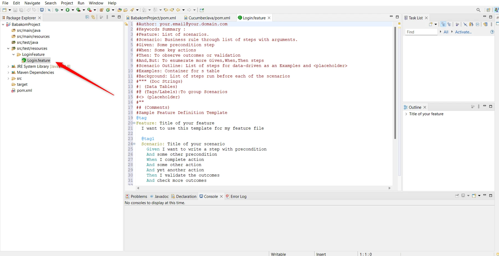

</center>

> If Cucumber Eclipse plugin isn’t already installed, then go to Help and then Eclipse Marketplace, search for Cucumber and install the plugin.

<center>

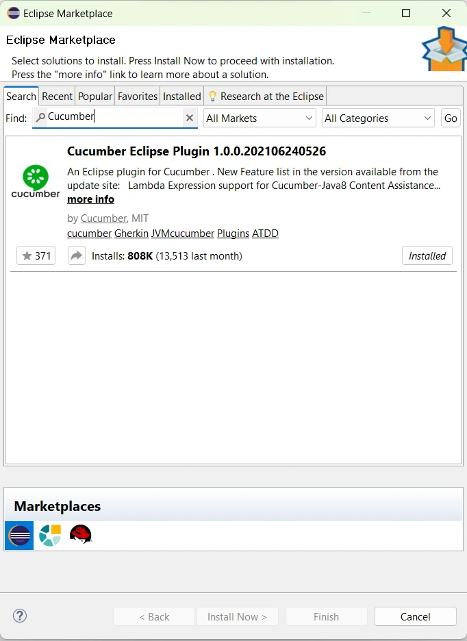

</center>

3. Now, remove all the content and add your steps definition for a feature using Gherkin Syntax.

<center>

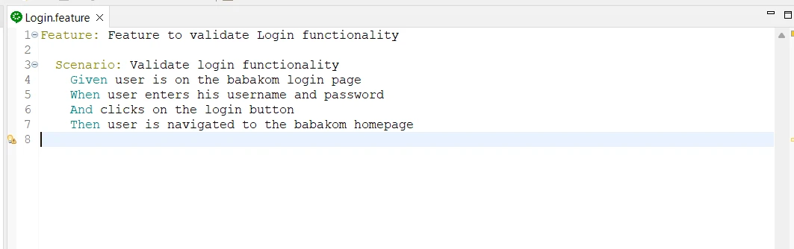

</center>

4. Create a new folder under src/test/java and name it as StepsDefinition.

<center>

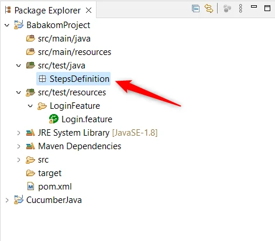

</center>

5. Create a new Class under StepsDefinition folder and name it as LoginSteps.

<center>

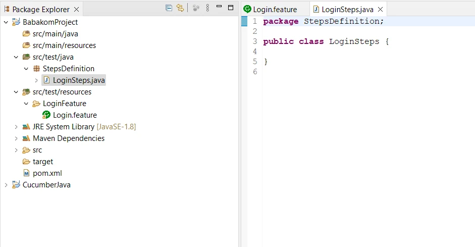

</center>

6. Create functions for each mentioned steps defined in the Login.feature file. Also, add Cucumber annotations against each step. Make sure the steps are exactly similar.

<center>

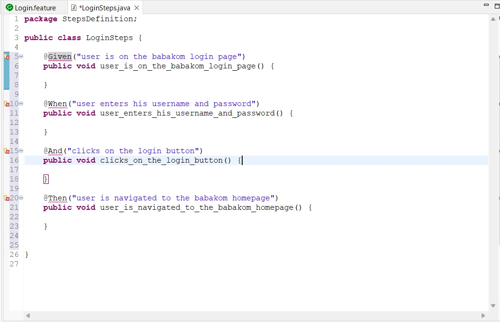

</center>

7. import Cucumber annotations in the Java test script.

<center>

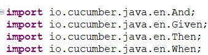

</center>

## Create a Runner Class

1. Create a class under StepsDefiniton folder with the name Runner.

<center>

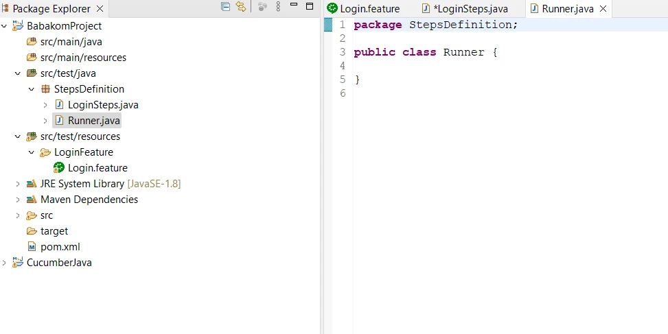

</center>

2. Now, add Cucumber annotation @RunWith(Cucumber.class) just above the class Runner and import Cucumber annotation.

<center>

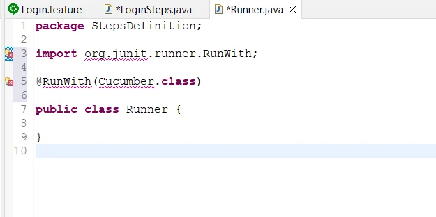

</center>

3. Also add Cucumber annotation @CucumberOptions(features="",glue={""}) and provide features and steps definition's files location.

<center>

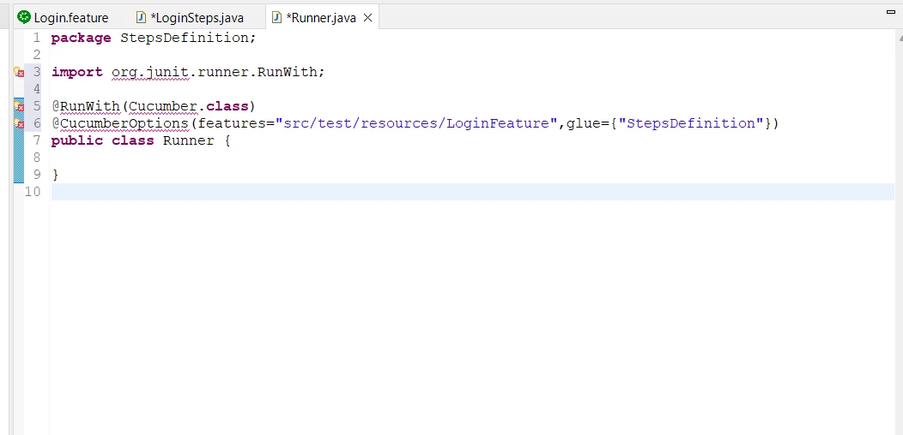

</center>

4. Again add import the Cucumber annotation.

<center>

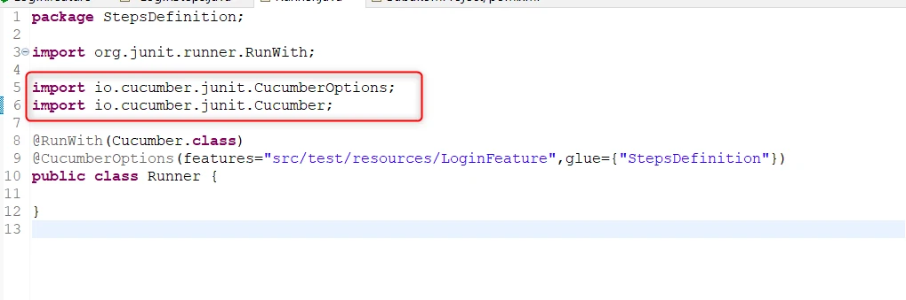

</center>

## Adding Chrome Driver

To add the Chrome Driver, follow the steps below:

1. Go to src/test/resources folder and create a new folder under it with the name Drivers.

2. Now add the Chromedriver.exe file here.

<center>

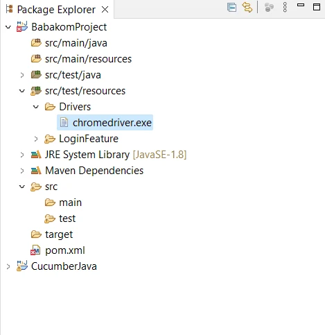

</center>

3. Now add the following commands in LoginSteps.java file.

<center>

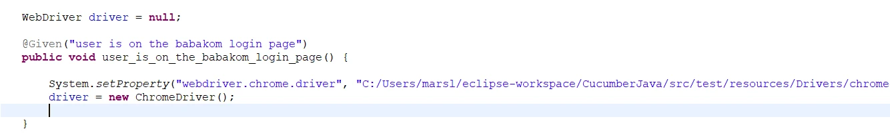

</center>

> Make sure the path of ChromeDriver is accurate, otherwise this will not work.

## Creating your First Test Case

As we have defined the test steps for our testcase in Login.feature files. Now, we are going to add the code for each steps which are defined as a method in our LoginSteps class.

1. @Given Test Method:

For @Given Test Method, we will add the following code:

``` bash
driver.manage().window().maximize()
driver.navigate().to("<https://babakom-develop.babakom.sa/login/login>")
```

The first line of the code will maximize the browser’s window, and the second line will navigate the user to Babakom login page.

<center>

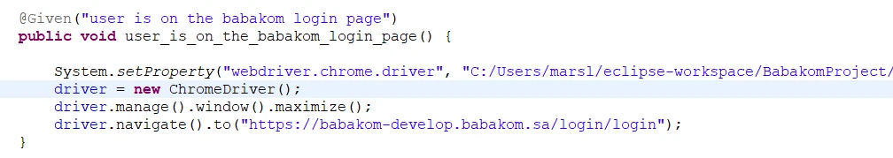

</center>

2. @When Test Method:

For @When Test Method, we will add the following code:

``` bash
driver.manage().timeouts().implicitlyWait(Duration.ofSeconds(10));
driver.findElement(By.id("69c9a06e-3923-5ae8-5249-5f88d1127e8d")).sendKeys("");
driver.manage().timeouts().implicitlyWait(Duration.ofSeconds(10));
driver.findElement(By.id("93fee15a-c1c0-4b9d-f8a3-0ca9c3553887")).sendKeys("");
```

> Enter your email in sendkeys in line no 2, and your password in line 4.

<center>

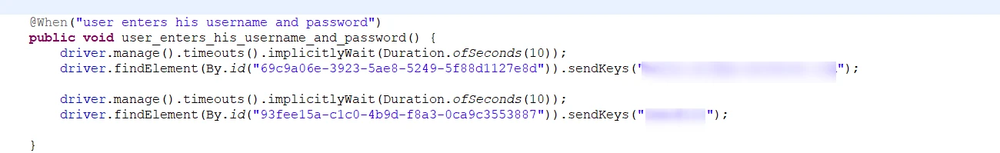

</center>

3. @And Test Method

For @And Test Method, add the code for clicking on the Login button.

``` bash
driver.findElement(By.xpath("//*[@id=\"LE_0c118eb6-577a-d619-d687-921ac0484b74\"]/evi-button/button")).click();
```

<center>

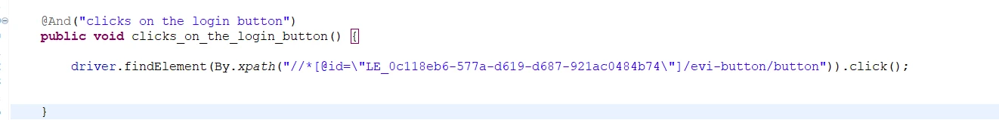

</center>

4. @Then Test Method

Now, add the implicit wait command for the 4th step to see whether the user is navigated to the babakom homepage or not.

<center>

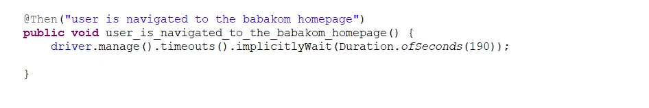

</center>

## Let’s Run the code

Now, to run your code go to Login.feature file and click on the Run and then Run as 1 Cucumber Feature.

<center>

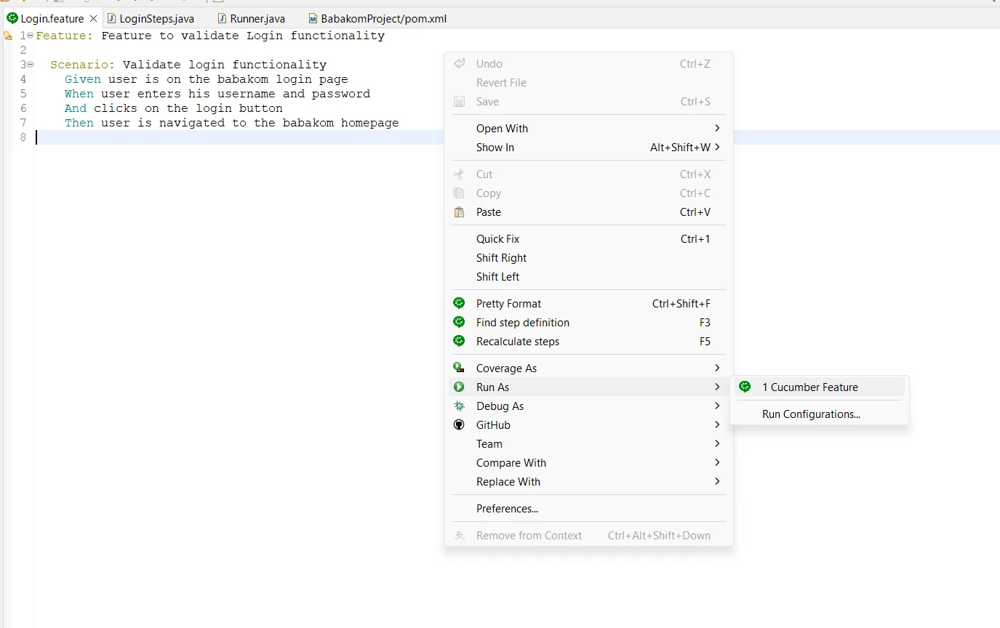

</center>

If all the test steps have been passed, you will see them as Passed in the Console below.

<center>

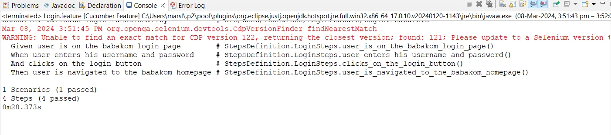

</center>

You have created and ran your first test!
