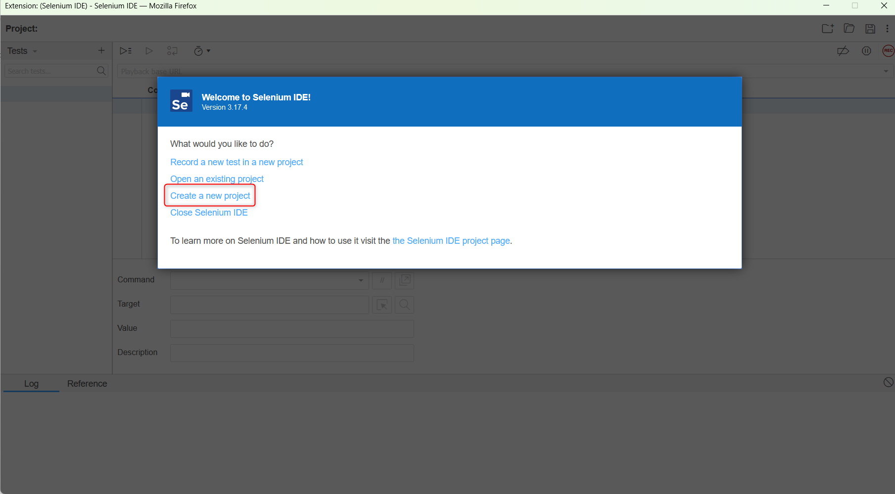
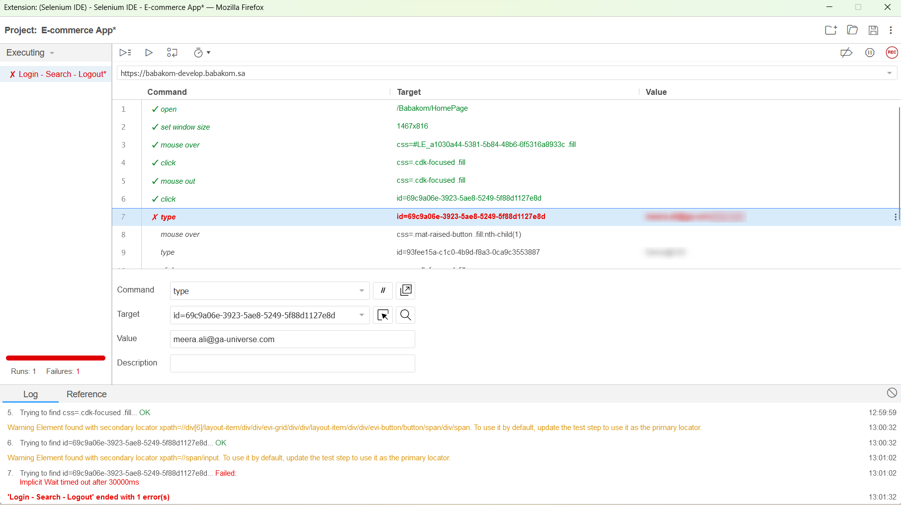

# Testing the GA_Universe App using the Selenium IDE

Selenium IDE is a plugin that records and plays back all the user interactions. Each user action is recorded and can be played back to ensure that the application runs smoothly.

**Prerequisites**

- Download and install browsers that support Selenium IDE (Chrome, Firefox, Edge)

- Install the Selenium IDE extension for each browser ([Chrome](https://chromewebstore.google.com/detail/selenium-ide/mooikfkahbdckldjjndioackbalphokd?pli=1), [Firefox](https://addons.mozilla.org/en-US/firefox/addon/selenium-ide/), [Edge](https://microsoftedge.microsoft.com/addons/detail/selenium-ide/ajdpfmkffanmkhejnopjppegokpogffp))

## How to Create and Run an Automated Test

Let’s create the first automated test by using Selenium IDE.

1. Open your desired browser and then click on Selenium IDE on the browser toolbar.

2. Now select the option Create a New Project.

3. Now name your project and click on the OK button. We are naming it E-commerce App.

4. Click on the Record button on the top right corner of the page. Now, enter the URL of your application and click on the Start Recording button.

> This will open up the application in a new browser window. The Selenium IDE will record all the steps you perform in this window.

5. Enter your Email and password, and then click on the Login button.

6. After you have successfully logged in, click on the search bar and enter any product name, here I am taking “Caramel“ and then click on Search icon.

7. Now, click on the Profile Name and then click on the Logout button.

8. Click on the close icon on the browser window and you will see the Selenium IDE screen.

9. Click on the record icon to stop recording and give a name to your first test and then click on the OK button.

10. Now, you can click on the Record button to play the recorded script.

All the passed test will be marked as green as shown in the picture below:

## Changing a Test Target

If for some reason, your test run resulted in a failure, then you can change the value of the locator.

1. Click on the failed test step.

2. Now, click on the Target, and choose the xpath id or other locators.

3. Now, run the test again.

>You can also follow these steps for elements that require more time to find and are identified using a secondary locator.
