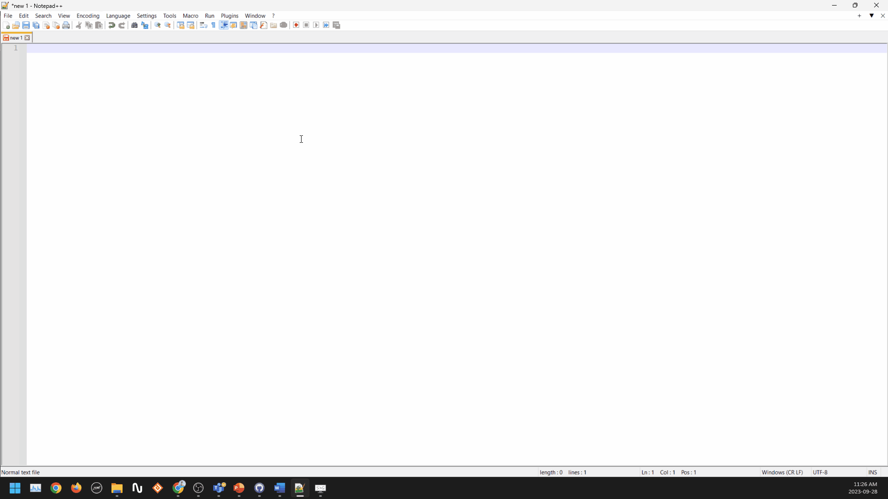

# Corporate Identity

Corporate identity is where you will design the general look of website you will create using GA

Under Corporate Identity, you can modify the following:

- Themes; the general look of the website
- Icons; the images/icons used for tabs and buttons
- Fonts; fonts which will be available to use in the website
- CSS Variable; one of the three CSS types (Color, FontSize, Font)
- CSS Classes; used to create a CSS file for the website to follow
- Control Styles; used to create decorations which can be used on any element
- Chart Palette; used to define a style for the charts to follow
- AppBuilder; used for defining how the AppBuilder looks to you, none of these settings is shown in production
- Meta tags; meta tags that are set for the instance. Ex: Changing the title meta tag changes the tab title everywhere in the instance

## Example

Let's create a new theme and add them to a navigation

1. Open the settings website
2. Click on corporate identity
3. Click on Themes:
   1. Click on + To create a new theme
   2. Rename the new theme
   3. Write the translations if needed
   4. Set is default and is dark theme flags as needed
   5. Select Control style from Material or Bootstrap, We will go with Material.
   6. Change the General Settings as needed
   7. Change the font as needed
   8. Change table styles as needed:
   9. Pick chart style from down:
   10. Change text color as needed
   11. Change background as needed
   12. Change foreground as needed
   13. Click on save to add the style

Now to adding it to the navigation:

4. Go to Layout
5. Go to Navigation
6. Select correct navigation
7. Pick the theme you just added as default theme
8. Pick the theme you just added in the available themes
9. Save

