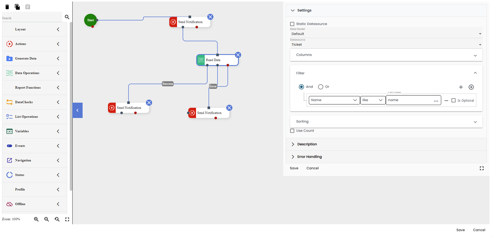
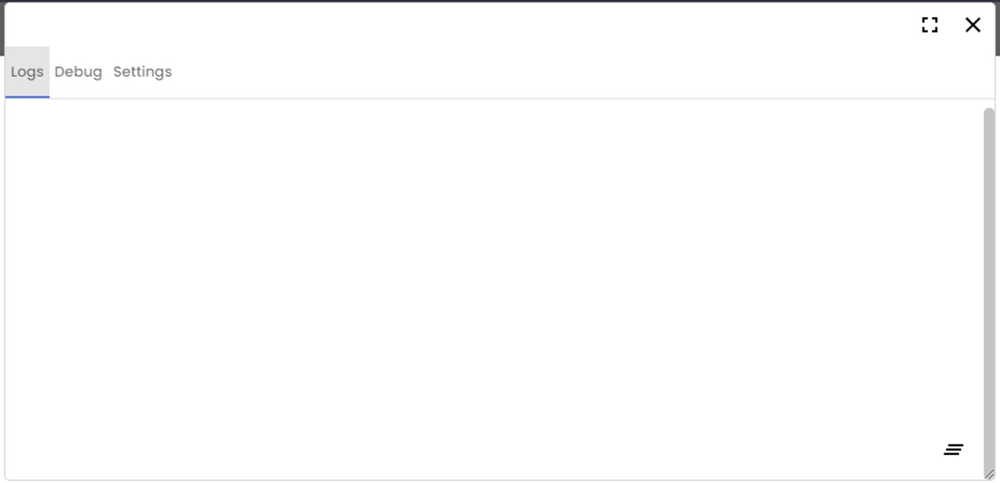
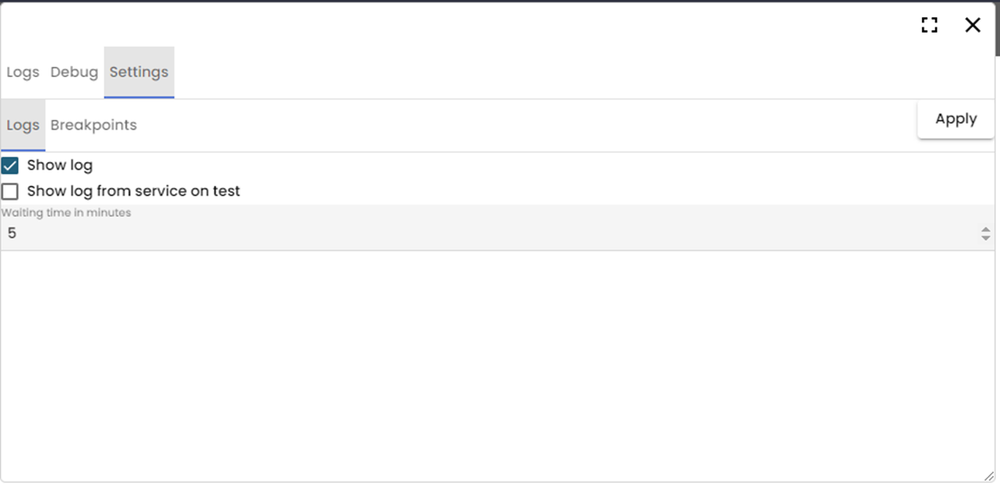
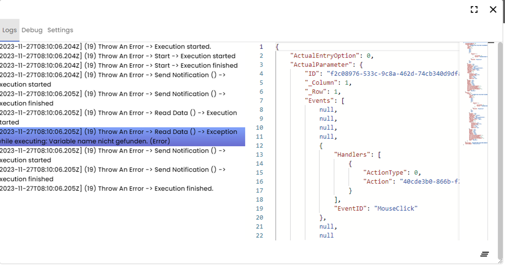
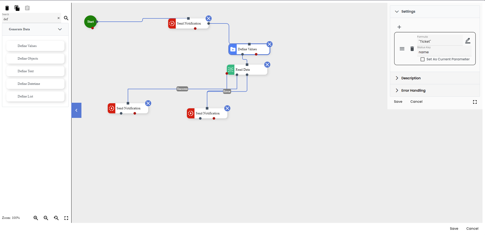
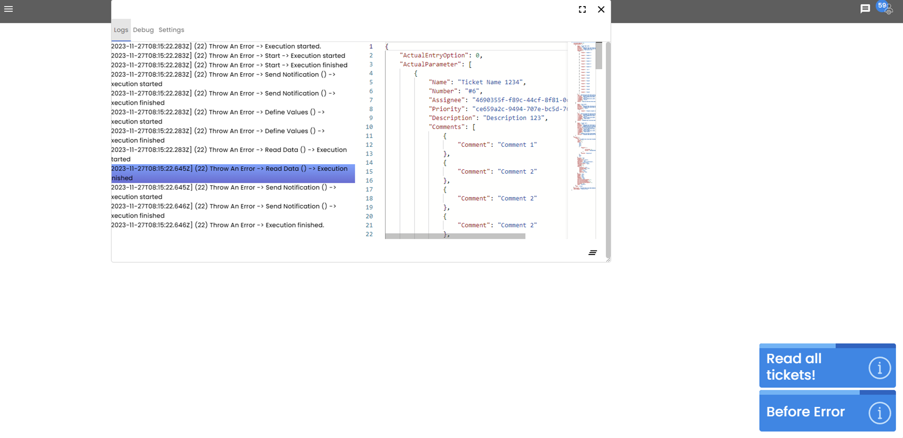
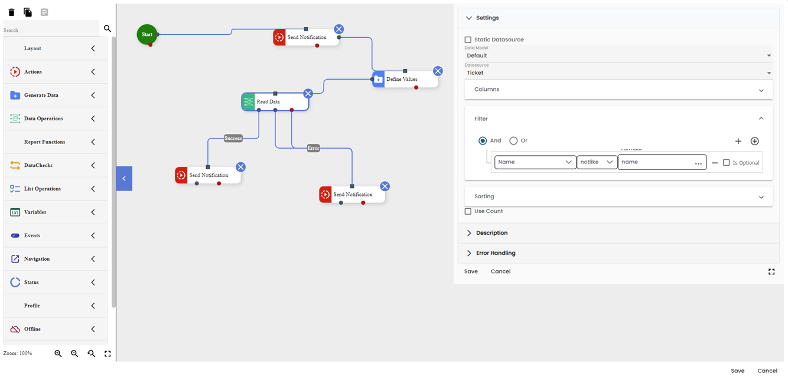
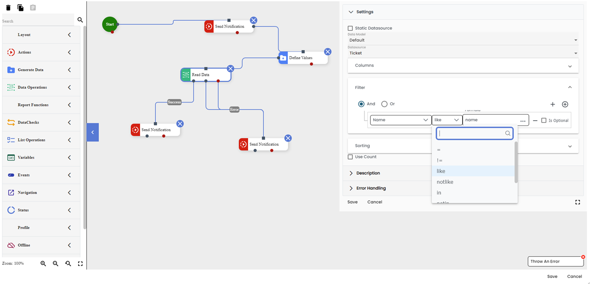

# Debugging

In this tutorial, I will show you how to use the debugging tools available in GA_Universe, to start with debugging lets create something that we shouldn’t, how about reading from a database while filtering with a null value?

That should work for us! (Do not do this in production kids!), now let us run the workflow and see what happens, oh no, it didn’t read them correctly and it threw an error. What could be the cause? Let’s start using the debugging tools in GA to help lead us in the right direction.

There are two ways to go about debugging in GA, the first is the simpler one of just checking the logs and seeing where the error occurred, this is useful for runtime errors.

## Logs

To start with let us use the Log tool available by pressing F12 in any page:

It is empty as a wasteland, how about we fill it with logs? Navigate to the settings area and check enable logs and click apply:

Lets test our workflow again, trigger the event that you created for running the workflow and see the logs tab again

Oh no, there is a variable we are using which we have not defined! Let us fix that:

Let us test if our solution works, try running the workflow again:

Works as intended! You can use the logs to check the status of anything inside the workflow, and how it changes from the current block to the next, but what if you have an something that doesn’t throw an error, for example a logic error? This is where the Debugging tool comes in handy.

## Debugging

First lets create a case where we have a logic error, how about we use the same workflow we created (And fixed) before, let us flip the filtering from “like” to “notlike”:

Now it is going to filter the tickets, but it is going to filter incorrectly, what should we do? How about we use a break point to see if that would help us!

A breakpoint is something to use if you want to see what happens in each workflow block, or each line in a script by moving one step at a time or until you reach a different breakpoint. For now, lets show you how to create a breakpoint:

Open the debugging tool by pressing F12, then navigate to the settings tab followed by the breakpoints section, now look up the workflow that you think is causing this issue and insert a break point in any of the workflow blocks for example the start block. Finally navigate to the debug tab and attach the process to the current window (Useful if you have two windows of GA open) and finally click apply in the settings tab.

<video controls="controls">
  <source src="/img/debugging8.mkv" />
</video>

Now whenever you run the workflow it will stop at the first breakpoint to allow you to go one step at a time to debug it and see where the logic error happens!

<video controls="controls">
  <source src="/img/debugging9.mkv" />
</video>

From the debug we can see that is filtering based on an incorrect statement, let us fix that by changing the filtering to use “like” and not “notlike”

And there you have it, that is how easy it is to debug workflows using GA_Universe!
