# General Admin Analytics

Welcome to this tutorial on creating General Admin Analytics dashboards in General Admin. This guide will walk you through the significance of reporting and the steps involved in crafting dashboards in the General Admin platform.

## The Importance of Reporting

Reporting is a cornerstone in today's business environment. By harnessing data visualization, it bolsters decision-making, enabling stakeholders to comprehend intricate data rapidly and efficiently. Not only does reporting offer insights that can spur business growth, but it also ensures real-time identification of business opportunities and challenges. Tracking key performance indicators in real-time is fundamental for maintaining business agility, facilitating prompt interventions when required. Reporting simplifies the often challenging task of data interpretation, making it more streamlined and accessible to relevant entities.

### Prerequisites for General Admin Analytics

Before delving into General Admin Analytics, it's essential to lay down the basics. Central to any solid reporting mechanism are DataObjects, which need to be diligently populated with relevant data. This ensures the analyzed and reported information is both accurate and pertinent. The quality of this data can have a significant bearing on the insights derived and decisions made.

A vital component in General Admin Analytics is the ROLAP (Relational Online Analytical Processing) data source, a potent tool enabling dynamic multidimensional analysis of extensive data. Moreover, transitioning DataObjects to a structured, query-optimized setting is crucial. Here, relational tables come into the picture, ensuring seamless DataObject migration and preserving data integrity

### Overview of the Steps

General Admin offers a structured process for report generation, demanding meticulous execution of several steps:

#### Data Migration and Timetable Creation

Start with migrating data from DataObjects to relational objects, optimizing data structures for advanced queries. Once data is structured appropriately, create a Timetable for date-based queries, essential for time-series analyses

#### Dimensions, Cubes, and Chart Implementation

With data set and timetable in place, create dimensions for each DataObject, aiding data categorization. Following this, set up a ROLAP cube with specific measurements. Lastly, use chart elements for data visualization.

#### Final Steps - Querying and Assigning to Charts

Conclude by querying data using the ROLAP cube, extracting data segments for the report. Assign this data to charts, finalizing the report.

## Practical Application: The "Product Sales" Example

While theoretical understanding is crucial, applying these steps in real scenarios offers clarity. Let's consider an application named "Product Sales" for practical insight.

#### Data Structure

"Product Sales" mainly deals with three tables: Products, Orders and Customers. Every Order has a list of unique IDs, referenced in the Product table, and a customer ID.

#### Migration to Relational Tables

To maximize General Admin power, migrate data from these tables to relational tables. Automate this process through service-side workflows, ensuring data accuracy.

#### Querying the Data

Post-migration, extract insights like the average order value per product. Set up a query referencing product names and fetching associated order values. Aggregate these to calculate the average order value for each product.

#### Visualizing the Insights

Visualize average order values using application chart elements, like a bar chart, showcasing each product's name alongside its average order value.

### Setting Up a ROLAP Data Source

Establishing a ROLAP data source in General Admin is straightforward:

1. Navigate to Data Sources under the Data tab
2. Click the + Create New button in the bottom left corner
3. Assign a descriptive name
   > Note: This name can't be changed
4. Choose ROLAP as the data source type
5. Save your settings

<center>

<video controls="controls">
  <source src="/media/tut8-1.mov" />
</video>

</center>

### Creating a Product Relational Table

The DataObject structure for the products object is:

<center>


</center>

Preview of the products object's data:

<center>

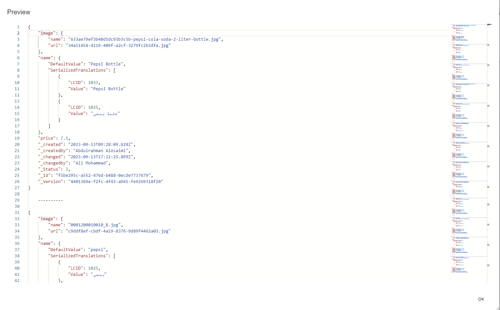

</center>

Now you will create a relational table to hold this data, you can ignore images since they are not useful in generating reports, to do this in General Admin do the following:

1. Navigate to Data -> Data Model -> <your_data_model_name\> -> Relational -> Container Tables
2. Click the + Create New button in the bottom left corner
3. Assign the table a name
   > Note: This name can't be changed
4. Specify a schema name
5. Select the data source
6. Add fields:
   - ID (primary string, length 50)
   - Product (string, length 50)
   - Product_Name_en (string, length 50)
   - Product_Name_sa (string, length 50)
     > Note: You can ignore the en and sa values if you will generate reports in one language

The table structure is:

<center>

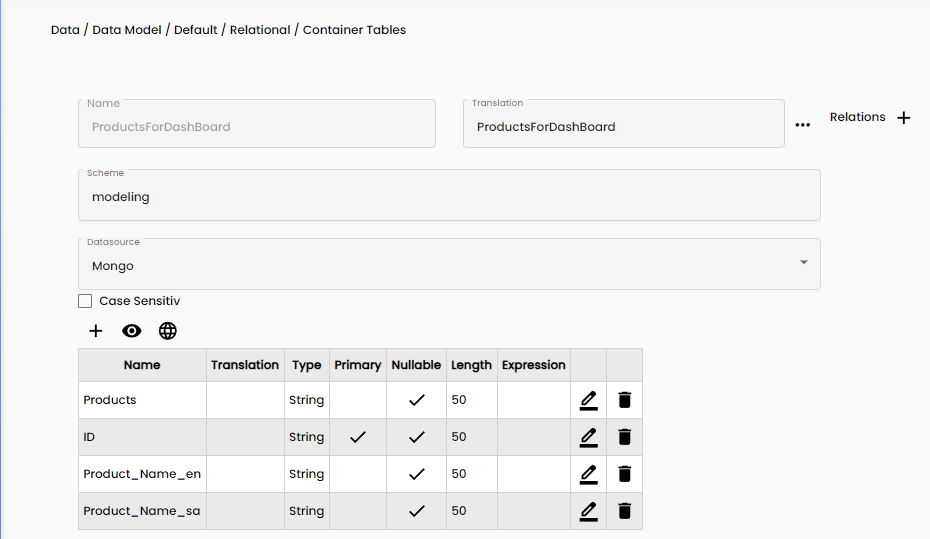

</center>

#### Data Migration Process

The Data Migration Process is the transition of the product data from DataObjects to relational tables. The provided TypeScript code facilitates this migration.

```typescript
import {
  WorkflowStatus,
  Global,
  ContainerAccess,
  ContainerMultiAccess,
  ContainerRelationalAccess,
  TranslatedString,
  Convert,
  Math,
} from "System";
import {
  RestFilter,
  Comparer,
  Concat,
  Guid,
  DbSorting,
  SortColumn,
  FilterColumn,
} from "Models";
import { Utilities } from "Utilities";
import { Product } from "ClassObjects.Default";
export class Main {
  _Status: WorkflowStatus;

  _modelContainerID: Guid;

  _RelContainerAccessModel: ContainerRelationalAccess;

  _DataSourceIdMongo: Guid;
  _DataSourceIdPostgreSQL: Guid;

  constructor() {
    this._Status = Global.getStatus();

    this._DataSourceIdMongo = ContainerAccess.DataSourceNameToId("Mongo");

    this._modelContainerID = ContainerAccess.ContainerNameToId(
      "Default",
      "Product",
      this._DataSourceIdMongo
    );

    this._RelContainerAccessModel =
      ContainerAccess.CreateContainerRelationalAccess(
        "Default",
        "ProductsForDashBoard",
        null,
        this._DataSourceIdMongo
      );
  }
  run(): void {
    // Delete previous entries, not recommended to use but easier for our case
    this._RelContainerAccessModel.ExecuteDelete();
    let filter = new RestFilter();
    filter.Filters = [];
    filter.Columns = [];
    filter.Sort = [];

    let products = ContainerAccess.SearchObjects(
      this._modelContainerID,
      filter
    );
    if (products != null && products.length > 0) {
      for (let product of products) {
        let productObj: Product = product;
        let row = new Map();
        row.set("Product", productObj.name.DefaultValue);
        row.set(
          "Product_Name_en",
          Utilities.getTranslationEnUsOrDefault(productObj.name)
        );
        row.set(
          "Product_Name_sa",
          Utilities.getTranslationArabicOrDefault(productObj.name)
        );
        row.set("ID", product._Id);
        this._RelContainerAccessModel.ExecuteInsert(row);
      }
    }
  }
  stop(): void {}
}
```

> Note, the translation methods were created in a script library, the code is found here:

```typescript
export class Utilities {
  constructor() {}
  run(): void {}
  stop(): void {}

  public static getTranslationByLcidOrDefault(translationString, lcid): any {
    let retVal = "";
    if (
      translationString != null &&
      translationString["DefaultValue"] != null
    ) {
      retVal = translationString["DefaultValue"];
      if (lcid != null || translationString["SerializedTranslations"] != null) {
        for (let trans of translationString["SerializedTranslations"]) {
          if (trans["LCID"] == lcid) {
            return trans["Value"];
          }
        }
      }
    }

    return retVal;
  }

  public static getTranslationArabicOrDefault(translationString): any {
    return Utilities.getTranslationByLcidOrDefault(translationString, 1025);
  }

  public static getTranslationEnUsOrDefault(translationString): any {
    return Utilities.getTranslationByLcidOrDefault(translationString, 1033);
  }
}
```

The resulted relational table after the migration of the Product DataObject:

<center>

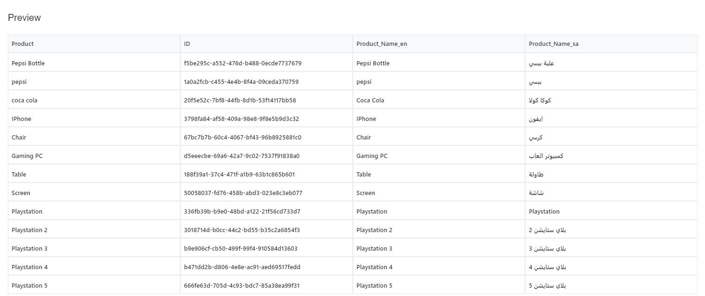

</center>

### Create Customer Relational Table

The customer DataObject has the following structure:

<center>


</center>

Preview of the Customer object's data:

<center>

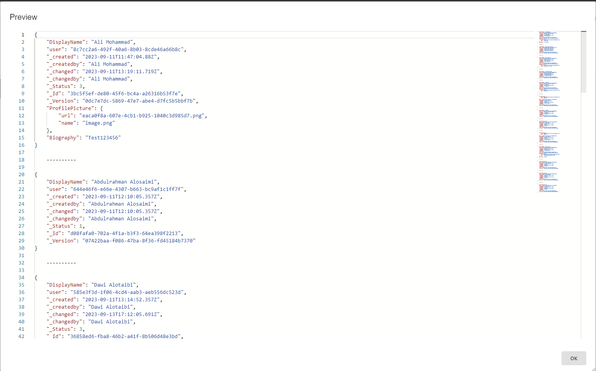

</center>

We will migrate this into a relational table, the steps are the same steps we did for the Product data migration process with some minor changes. To migrate the data follow the following steps:

1. Navigate to Data -> Data Model -> <your_data_model_name\> -> Relational -> Container Tables
2. Click the + button in the bottom left corner
3. Assign the table a name
   > Note: This name can't be changed
4. Specify the schema name used for the Product table
5. Select the correct data source
6. Add fields:
   - CustomerId (string, length 50)
   - DisplayName (String, length 50)

The table structure is:

<center>

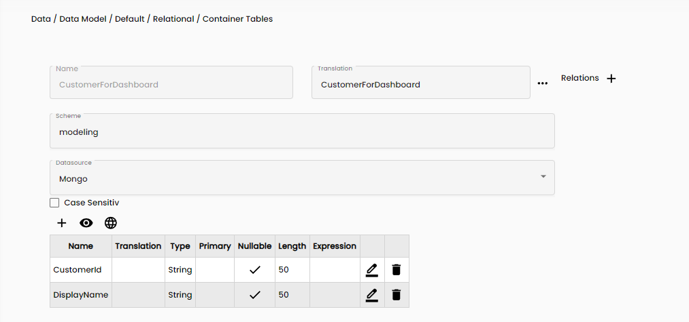

</center>

#### Data Migration Process

Migrate The Order data from DataObjects to relational tables using the provided TypeScript code.

```typescript
import {
  WorkflowStatus,
  Global,
  ContainerAccess,
  ContainerMultiAccess,
  ContainerRelationalAccess,
  TranslatedString,
  Convert,
  Math,
} from "System";
import {
  RestFilter,
  Comparer,
  Concat,
  Guid,
  DbSorting,
  SortColumn,
  FilterColumn,
} from "Models";
import { Utilities } from "Utilities";
import { UserProfile } from "ClassObjects.Default";
export class Main {
  _Status: WorkflowStatus;

  _modelContainerID: Guid;

  _RelContainerAccessModel: ContainerRelationalAccess;

  _DataSourceIdMongo: Guid;
  _DataSourceIdPostgreSQL: Guid;

  constructor() {
    this._Status = Global.getStatus();

    this._DataSourceIdMongo = ContainerAccess.DataSourceNameToId("Mongo");

    this._modelContainerID = ContainerAccess.ContainerNameToId(
      "Default",
      "UserProfile",
      this._DataSourceIdMongo
    );

    this._RelContainerAccessModel =
      ContainerAccess.CreateContainerRelationalAccess(
        "Default",
        "CustomerForDashboard",
        null,
        this._DataSourceIdMongo
      );
  }
  run(): void {
    this._RelContainerAccessModel.ExecuteDelete();
    let filter = new RestFilter();
    filter.Filters = [];
    filter.Columns = [];
    filter.Sort = [];

    let userprofiles = ContainerAccess.SearchObjects(
      this._modelContainerID,
      filter
    );
    if (userprofiles != null && userprofiles.length > 0) {
      for (let userprofile of userprofiles) {
        let userprofileObj: UserProfile = userprofile;
        let row = new Map();
        row.set("CustomerId", userprofileObj._Id);
        row.set("DisplayName", userprofileObj.DisplayName);
        this._RelContainerAccessModel.ExecuteInsert(row);
      }
    }
  }
  stop(): void {}
}
```

The resulted relational table after the migration of the Customer DataObject:

<center>

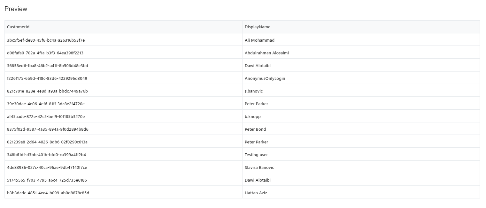

</center>

### Create Order Status Relational Table

We have an ENUM for the order status as shown below.

<center>


</center>

We want to migrate it into a relational table, like the one shown below:

<center>


</center>

So we will run the one time script shown below:

```typescript
import {
  WorkflowStatus,
  Global,
  ContainerAccess,
  ContainerMultiAccess,
  ContainerRelationalAccess,
  TranslatedString,
  Convert,
  Math,
} from "System";
import {
  RestFilter,
  Comparer,
  Concat,
  Guid,
  DbSorting,
  SortColumn,
  FilterColumn,
} from "Models";
import { Utilities } from "Utilities";
import { UserProfile } from "ClassObjects.Default";
export class Main {
  _Status: WorkflowStatus;
  _RelContainerAccessModel: ContainerRelationalAccess;

  _DataSourceIdMongo: Guid;
  _DataSourceIdPostgreSQL: Guid;

  constructor() {
    this._Status = Global.getStatus();

    this._DataSourceIdMongo = ContainerAccess.DataSourceNameToId("Mongo");
    this._RelContainerAccessModel =
      ContainerAccess.CreateContainerRelationalAccess(
        "Default",
        "OrderStatusForDashboard",
        null,
        this._DataSourceIdMongo
      );
  }
  run(): void {
    this._RelContainerAccessModel.ExecuteDelete();

    let row = new Map();
    row.set("ID", "deabebe1-cfdf-b8c6-1aa4-f1fd2352862c");
    row.set("Name", "Processing");
    this._RelContainerAccessModel.ExecuteInsert(row);
    row = new Map();
    row.set("ID", "2cd997a0-a626-c899-00f3-769e5a1c22b7");
    row.set("Name", "InProgress");
    this._RelContainerAccessModel.ExecuteInsert(row);
    row = new Map();
    row.set("ID", "a8b3aaf4-f143-b42a-34d9-5c6df032dd9f");
    row.set("Name", "Completed");
    this._RelContainerAccessModel.ExecuteInsert(row);
    row = new Map();
    row.set("ID", "c42463d5-9896-f67d-3035-a4a193135ddb");
    row.set("Name", "Rejected");
    this._RelContainerAccessModel.ExecuteInsert(row);
  }
  stop(): void {}
}
```

The resulted relational table after the migration of the OrderStatus ENUM:

<center>


</center>

### Create 2 Order Relational Tables

We have an order DataObject as shown in the table below:

<center>


</center>

Preview of the Order object's data:

<center>


</center>

Since we have a list of products in each order, we will need to create 2 tables for the orders, one is for the full order, the other is for each product in the order.

#### Relational Table Full Order

1. Navigate to Data -> Data Model -> <your_data_model_name\> -> Relational -> Container Tables
2. Click the + Create New button in the bottom left corner
3. Assign the table a name
   > Note: This name can't be changed
4. Specify the schema name used for the Product table
5. Select the correct data source
6. Add fields:
   - OrderId (string, length 50)
   - Customer (string, length 50)
   - Status (string, length 50)
   - ItemCount (double)
   - TotalPrice (double)
   - Date (Date)

<center>

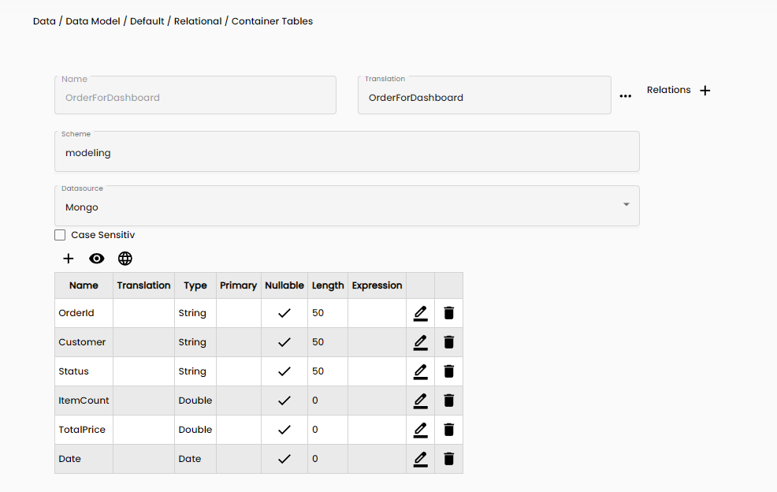

</center>

#### Relational Table Each Product

1. Navigate to Data -> Data Model -> <your_data_model_name\> -> Relational -> Container Tables
2. Click the + Create New button in the bottom left corner
3. Assign the table a name
   > Note: This name can't be changed
4. Specify the schema name used for the Product table
5. Select the correct data source
6. Add fields:
   - OrderId (string, length 50)
   - Item (string, length 50)
   - Customer (string, length 50)
   - Status (string, length 50)
   - ItemPrice (double)
   - Date (Date)

##### Data Migration Process

Migrate order data from DataObjects to relational tables using the provided TypeScript code.

```typescript
import {
  WorkflowStatus,
  Global,
  ContainerAccess,
  ContainerMultiAccess,
  ContainerRelationalAccess,
  TranslatedString,
  Convert,
  Math,
} from "System";
import {
  RestFilter,
  Comparer,
  Concat,
  Guid,
  DbSorting,
  SortColumn,
  FilterColumn,
} from "Models";
import { Order, Product } from "ClassObjects.Default";
export class Main {
  _Status: WorkflowStatus;

  _modelContainerIDOrder: Guid;
  _modelContainerIDProduct: Guid;

  _RelContainerAccessModelOrder: ContainerRelationalAccess;
  _RelContainerAccessModelOrderDetail: ContainerRelationalAccess;

  _DataSourceIdMongo: Guid;
  _DataSourceIdPostgreSQL: Guid;

  constructor() {
    this._Status = Global.getStatus();

    this._DataSourceIdMongo = ContainerAccess.DataSourceNameToId("Mongo");

    this._modelContainerIDOrder = ContainerAccess.ContainerNameToId(
      "Default",
      "Order",
      this._DataSourceIdMongo
    );

    this._modelContainerIDProduct = ContainerAccess.ContainerNameToId(
      "Default",
      "Product",
      this._DataSourceIdMongo
    );

    this._RelContainerAccessModelOrder =
      ContainerAccess.CreateContainerRelationalAccess(
        "Default",
        "OrderForDashboard",
        null,
        this._DataSourceIdMongo
      );
    this._RelContainerAccessModelOrderDetail =
      ContainerAccess.CreateContainerRelationalAccess(
        "Default",
        "OrderDetailForDashboard",
        null,
        this._DataSourceIdMongo
      );
  }
  run(): void {
    this._RelContainerAccessModelOrder.ExecuteDelete();
    this._RelContainerAccessModelOrderDetail.ExecuteDelete();
    let filter = new RestFilter();
    filter.Filters = [];
    filter.Columns = [];
    filter.Sort = [];

    let modelMap = new Map();
    let orders = ContainerAccess.SearchObjects(
      this._modelContainerIDOrder,
      filter
    );
    if (orders != null && orders.length > 0) {
      for (let order of orders) {
        let orderObj: Order = order;
        let row = new Map();
        let date: Date = orderObj._created;
        date = date.setHours(0);
        date = date.setMinutes(0);
        date = date.setSeconds(0);
        date = date.setMilliseconds(0);
        row.set("Date", date);
        row.set("OrderId", orderObj._Id);

        row.set("Customer", orderObj.customer);
        row.set("Status", orderObj.status);
        row.set("ItemCount", orderObj.products.length);
        row.set("TotalPrice", orderObj.totalPrice);

        for (let product of orderObj.products) {
          let productObj: Product = product;
          let rowdetail = new Map();
          rowdetail.set("Date", date);
          rowdetail.set("OrderId", orderObj._Id);

          rowdetail.set("Customer", orderObj.customer);
          rowdetail.set("Status", orderObj.status);
          rowdetail.set("Item", productObj._Id);
          rowdetail.set("ItemPrice", productObj.price);
          this._RelContainerAccessModelOrderDetail.ExecuteInsert(rowdetail);
        }

        this._RelContainerAccessModelOrder.ExecuteInsert(row);
      }
    }
  }
  stop(): void {}
}
```

The resulted relational table after the migration of the Full Order DataObject:

<center>

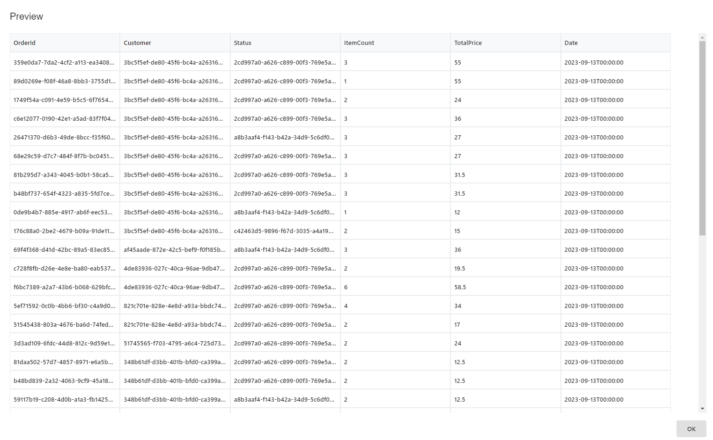

</center>

The resulted relational table after the migration of the Per Order DataObject:

<center>


</center>

### Running the Workflows

Run the data migration scripts to transfer Product, Order, Customer, and OrderStatus data. Implement schedulers or invoke workflows after DataObject changes for real-time migration.

To prevent data inconsistencies from deleting a product with linked orders:

1. **Order Deletion**: Delete linked orders before removing a product.
2. **Default Product Assignment**: Assign orders to a default product instead of deletion.
3. **Custom Solutions**: Flag deleted products, filtering them during queries, or implement cascading deletes.

We will now show you how to do delete orders linked to a specific product:

The first step is to create a new service side workflow, and name it Delete Effected Products, and inside of it do the following:

1. In the parameters tab, insert a parameter that will be passed by a client side workflow, and name it productId


2. Insert a read workflow block and query the order DataObject
3. Insert a for loop that loops over the orders and inside of the for loop do the following:
   1. Insert a read properties and read the products and the \_Id, and save them as: productList and orderID
      - Set the productList as the current parameter
   2. Insert a define value and name it productInOrder, make it false for now
   3. Insert a loop that loops over the current productList and inside of do the following:
      1. Insert a read properties and read the the \_Id and save it as: currentProduct
      2. Insert a data switch with one condition checking if the currentProduct is equal to passed productId
      3. If the data switch is true, insert a define values block and set productInOrder to be true
   4. After the product list loop, insert a data switch with one condition, checking if productInOrder is true
   5. If it is true, insert a a delete workblock and query the orderID to delete it
4. After the previous loop insert two run the workflows blocks and run the two workflows created above for filling in the products and orders

> Note: The final workflow will look like this:


The second step is more simple, and it is just calling the workflow whenever you delete a product, make sure to pass the productId to it, here is an example of that in the client side:

1. Read the values on the element where the product is stored
2. Read the \_Id from the product and name it productId
3. Delete the product from the DataObject table
4. Refresh the table on the browser
5. Undo styles on layout that allows editing of data
6. Run the workflow that was created in step 1, make sure to pass the productId to it

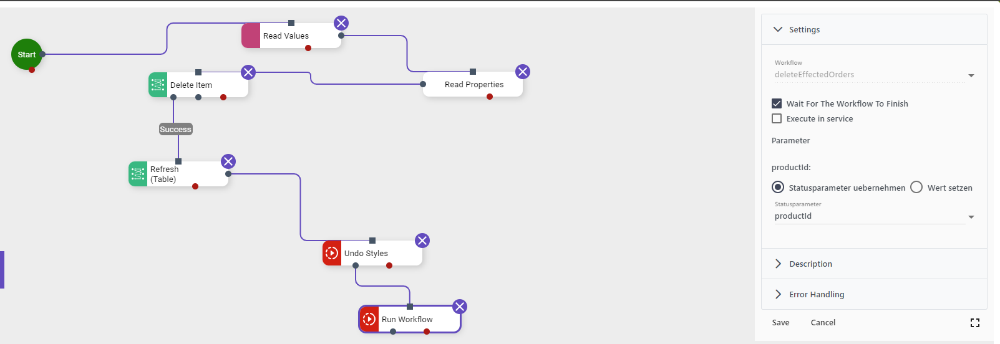

### Creating a Timetable

Timetables are vital for date-based queries. Here's how to create one in General Admin:

1. Navigate to Data -> Data Model -> <your_data_model_name\> -> Relational -> Container Datetime
2. Click the + Create New button in the bottom left corner
3. Assign the table a name
   > Note: This name can't be changed
4. Assign a data source
5. Define the Start Date
6. Configure the time span using Years Offset
   > Note: the offset is how many years to be generated after the start date
7. Select languages if needed

<center>


</center>

Preview:

<center>

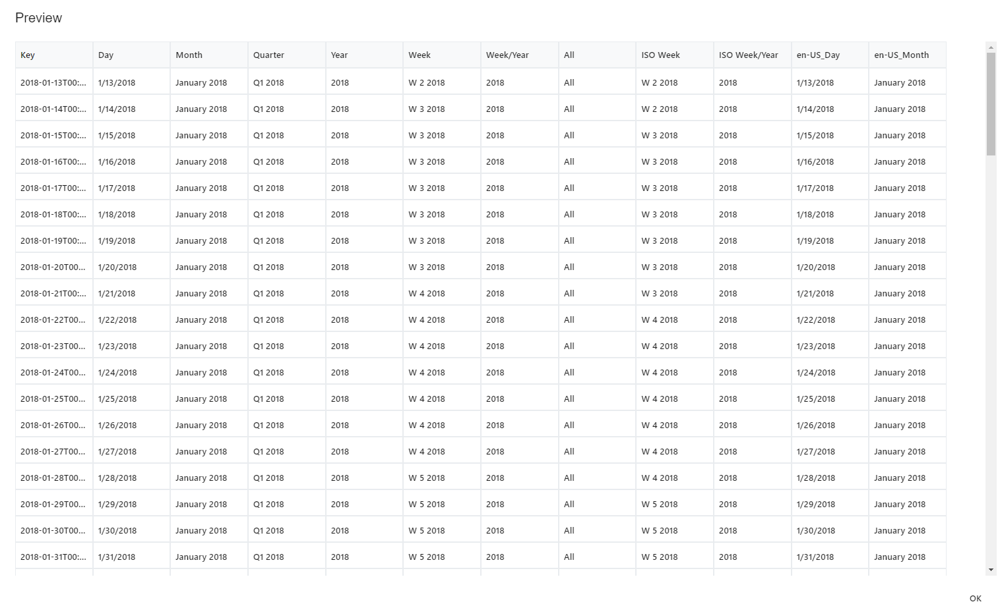

</center>

### Creating Dimensions

#### Crafting a Product Dimension

1. Navigate to Data -> Data Model -> <your_data_model_name\> -> Multidimensional -> Container Dimension
2. Click the + Create New button in the bottom left corner
3. Assign the table a name
   > Note: This name can't be changed
4. Select ROLAP Data source
5. Edit the Query Definition to incorporate the product table
6. Select all fields
7. Click OK
8. Add 1 attribute:
   - Name: Product
   - Description: Product
   - Key Column: ProductsForDashBoard (6) -> ID (8)
   - Name Column: ProductsForDashBoard (6) -> Product (7)
   - Type: Regular
   - Key Flag: True
   - Add translation if needed
9. Save

<center>

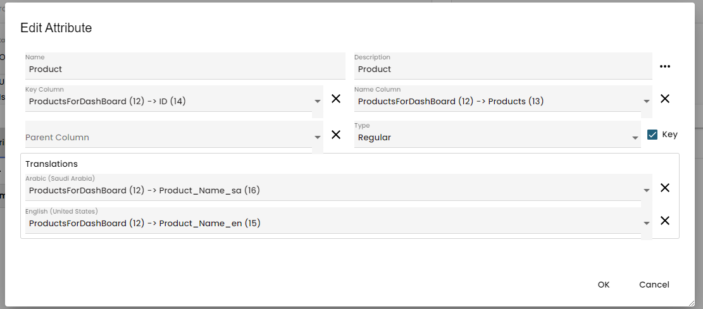

</center>

#### Crafting a Customer Dimension

1. Navigate to Data -> Data Model -> <your_data_model_name\> -> Multidimensional -> Container Dimension
2. Click the + Create New button in the bottom left corner
3. Assign the table a name
   > Note: This name can't be changed
4. Select ROLAP Data source
5. Edit the Query Definition to incorporate the Customer table
6. Select all fields
7. Click OK
8. Add 1 attribute:
   - Name: Customer
   - Description: Customer
   - Key Column CustomerForDashboard (1) -> CustomerId (2)
   - Name Column: CustomerForDashboard (1) -> DisplayName (3)
   - Type: Regular
   - Key Flag: True
9. Save

<center>


</center>

#### Constructing an Order Status Dimension

1. Navigate to Data -> Data Model -> <your_data_model_name\> -> Multidimensional -> Container Dimension
2. Click the + Create New button in the bottom left corner
3. Assign the table a name
   > Note: This name can't be changed
4. Select ROLAP Data source
5. Edit the Query Definition to incorporate the OrderStatus table
6. Select all fields
7. Click OK
8. Add 1 attribute:
   - Name: OrderStatus
   - Description: OrderStatus
   - Key Column: OrderStatusForDashboard (5) -> ID (6)
   - Name Column: OrderStatusForDashboard (5) -> Name (7)
   - Type: Regular
   - Key Flag: True
9. Save

<center>


</center>

#### Constructing a Time Dimension

1. Navigate to Data -> Data Model -> <your_data_model_name\> -> Multidimensional -> Container Dimension
2. Click the + Create New button in the bottom left corner
3. Assign the table a name
   > Note: This name can't be changed
4. Select ROLAP Data source
5. Mark IsTimeDim
6. Edit the Query Definition to include the TimeTable
7. Select these elements:
   - Key
   - Day
   - Month
   - Year
8. Click ok
9. Add first attribute:
   - Name: Date
   - Description: Date
   - Key Column: TimeTable (1) -> Key (2)
   - Name Column: TimeTable (1) -> Day (3)
   - Type: TimeDays
   - Key Flag: True
10. Add Second attribute:
    - Name: Year
    - Description: Year
    - Key Column: TimeTable (1) -> Key (2)
    - Name Column: TimeTable (1) -> Year (6)
    - Type: TimeYears
    - Key Flag: False
11. Add Third attribute:
    - Name: Month
    - Description: Month
    - Key Column: TimeTable (1) -> Key (2)
    - Name Column: TimeTable (1) -> Month (4)
    - Type: TimeMonths
    - Key Flag: False
12. Save

<center>


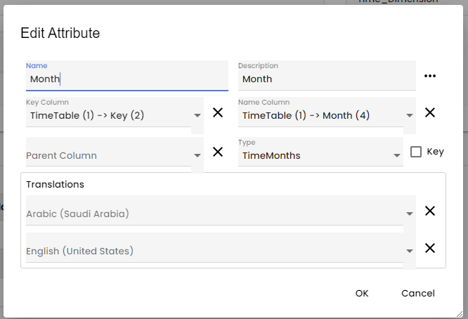

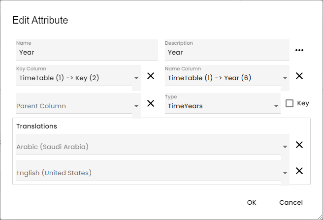

</center>

### Crafting an Order Cube

1. Navigate to Data -> Data Model -> <your_data_model_name\> -> Multidimensional -> Container Dimension
2. Click the + button in the bottom left corner
3. Assign the table a name
   > Note: This name can't be changed
4. Select ROLAP
5. Add the Customer, Status and time dimensions
6. Define values for ItemCount and TotalPrice
   - Both are of double type and aggregations are sum
7. Go to Data mapping
8. Select Edit Query Definition
9. Select Full Order Table
10. Select All Fields
11. Map the fields to each item correctly:
    - Time: OrderForDashboard (1) -> Date(7)
    - Customer: OrderForDashboard (1) -> Customer(3)
    - Status: OrderForDashboard (1) -> Status(4)
    - ItemCount: OrderForDashboard (1) -> ItemCount(5)
    - TotalPrice: OrderForDashboard (1) -> TotalPrice(6)
12. Save

<center>


</center>

### Crafting an Order Details Cube

1. Navigate to Data -> Data Model -> <your_data_model_name\> -> Multidimensional -> Container Dimension
2. Click the + button in the bottom left corner
3. Assign the table a name
   > Note: This name can't be changed
4. Select ROLAP
5. Add the Customer, Status, Product, and Time dimensions
6. Define values for ItemPrice
   • double type
   • aggregations sum
7. Go to Data mapping
8. Select Edit Query Definition
9. Select Details Order Table
10. Select All Fields
11. Map the fields to each item correctly:
    - Time: OrderDetailForDashboard (1) -> Date (5)
    - Customer: OrderDetailForDashboard (1) -> Customer(4)
    - Status: OrderDetailForDashboard (1) -> Status(6)
    - Status: OrderDetailForDashboard (1) -> Item(3)
    - ItemPrice: OrderDetailForDashboard (1) -> ItemPrice(7)
12. Save

<center>


</center>

### Constructing a General Admin Query for In-Page Analysis, Top 3 Customers of all time

1. Open a page and open the AppBuilder followed by Access Data Description:

   > Note: When you open the AppBuilder, please select edit mode and not view mode. When you select the edit mode the page becomes locked and you are the only one allowed to change it until the changes are accepted in the ChangeLog.

2. Click the + button in the top left corner to add a new query
3. Remove the default Relational Query
4. Add the model and Order Cube
5. Add Item count and Total price on X axis
   - Found on the values tab
6. Add Customer on Y Axis
7. Test the setup
8. Hide the Item count and Total price
   - By right clicking and hiding
9. Insert Calculated value, name it Average
   - Found on Special tab
10. Insert 2 tasks in the Tasks Tab:
    - Average will have the value: M6/M5
    - M6 is total price
    - M5 is Item count
    - Average – Customer – TopDown
    - Will take the value of the average
    - Take the customer level
    - Set the status at the top
    - Only 3 values
    - And add up the rest
11. Save and rename

Select Tab should look similar to this:

<center>


</center>

Average Task should look similar to this:

<center>

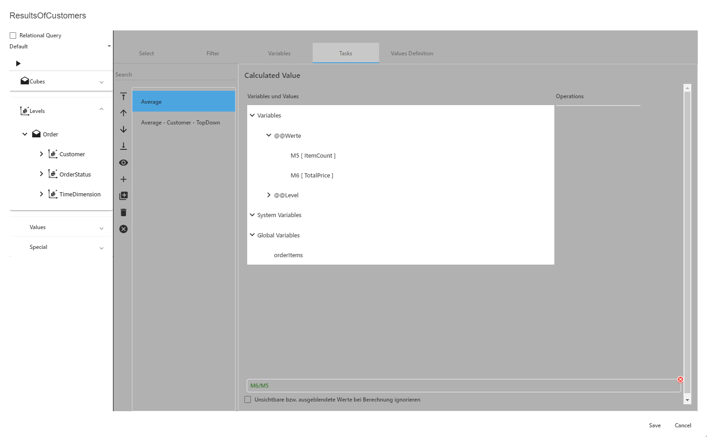

</center>

Average – Customer – TopDown should look similar to this:

<center>

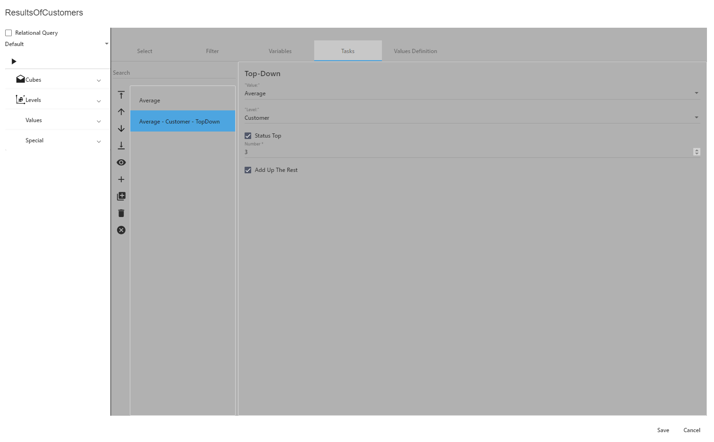

</center>

> Note: When you add a new task you must first select the task type.

### Visualization

Drag and drop a chart element from the report objects into the page, and then set the query to be the one you just created previously in the example.

<center>

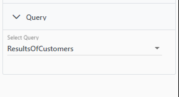

</center>

In the chart settings on the left side of the page select the chart type to be BarChart, finally save and refresh the page to see the results as shown in the image below.

<center>


</center>

Do note, we have not used other charts in this tutorial, that is left up to you, to test your knowledge and skills of creating reports in General Admin!

Possible charts:

<center>

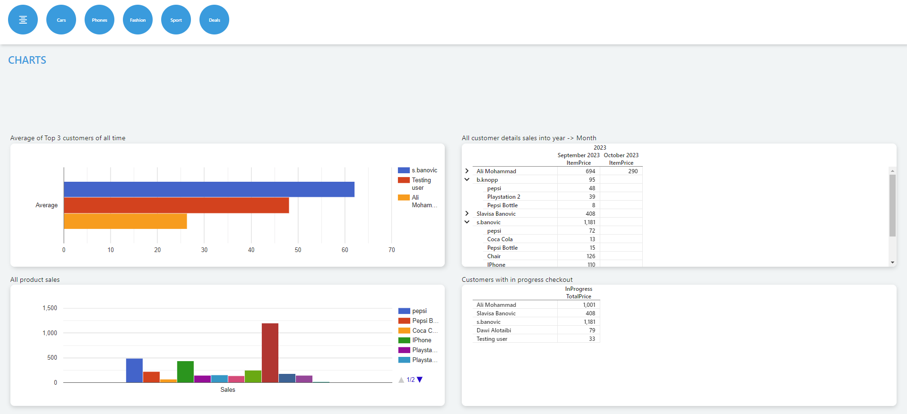

</center>

> Note: All changes made are saved locally on your account, and are not visible to the all other users. To make them visible to all users please accept the changes in the ChangeLog Overview in the settings.

## Conclusion

You're now equipped with the skills to use General Admin Analytics. For deeper insights, peruse our documentation or consult the General Admin Community. With knowledge of General Admin's low-code/no-code development capabilities, we're eager to see your creations. Keep innovating.
