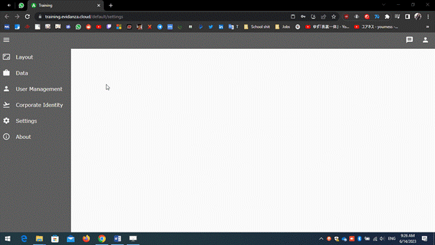

# Hello, World!

How to use GA to create your first "Hello, world!" page

Using GA is as simple as:

- Creating the page
- Choosing the control elements you want to use
- Dropping in place
- Configure as needed

- Create a page from settings.

  1.  Navigate to /default/settings/

  2.  Go to the layout tab.

  3.  Go to the pages tab.

  4.  Name your page and give your URL. For example, let's name it "HelloPage"

  - Note: The URL is how you navigate to it and the name is how you can search for it in the backend and so on.

  6.  Then chose the type of page, for now we will start with an empty page.

  7.  Click OK.

