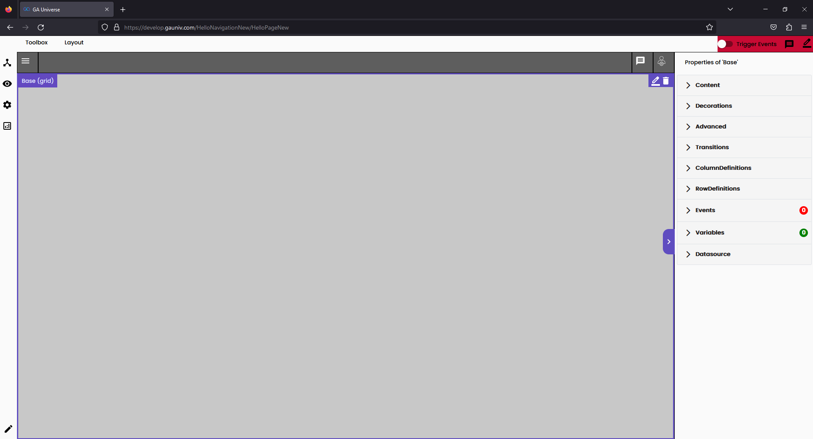
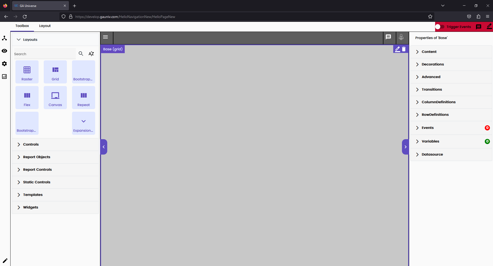
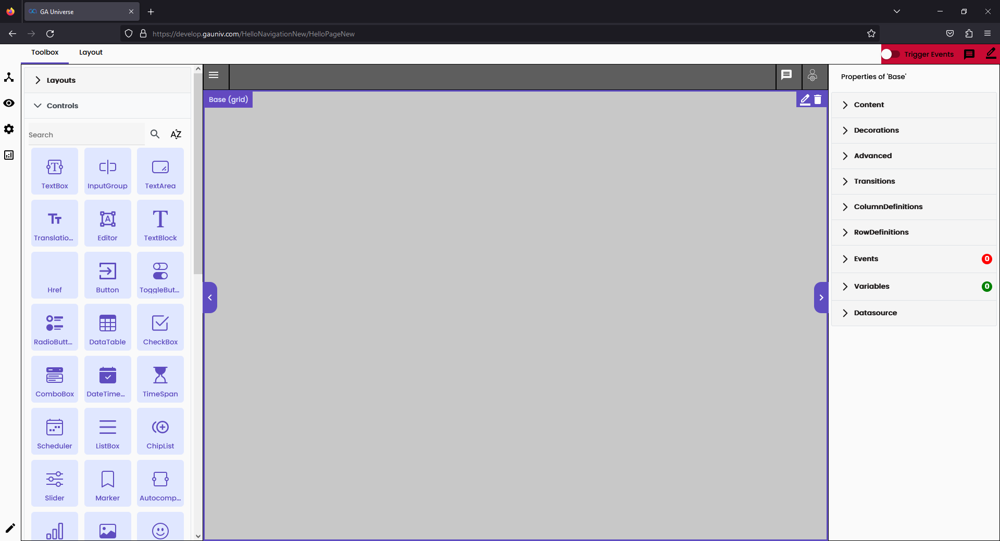

# Pages and Navigations

Pages are essentially your canvas. The page can have all the control elements and layouts on it. It also can have multiple views for reactive web pages i.e. mobile view.

## Pages

### Creating a page

1. Navigate to the settings area
2. Go to the layout tab
3. Go to the Pages tab
4. Click the *+ Create New button* in the bottom left corner
5. Name your page URL.
6. Choose the type of page (Empty page, Copy page, List Detail page, Table Detail page)
7. Click OK
8. After creating the page, you can edit it using the editing button
9. Create a navigation so the page can be accessed from the URL

### Page Types

| Page Type    | Description                                                                                                                               |
| ------------ | ----------------------------------------------------------------------------------------------------------------------------------------- |
| Empty        | Clean page that can be built from scratch to your liking                                                                                  |
| Copy         | A copy of an already existing page. It is not a reference, so changes will not be synchronized between them                               |
| List Detail  | Template for a page that already has a data table so the data can be manipulated. A datasource need to be selected prior to page creation |
| Table Detail | Similar to List Detail in functionality but differs in format                                                                             |

## Navigation

Navigations are a set of nodes and sub nodes that represent the URL and path to the pages. Each navigation can have different settings and themes.

### Creating a navigation

1. Navigate to the settings backend
2. Go to layout tab
3. Go to the navigation tab
4. Select your application from the Application drop down 
5. Click on *+ Create Main Node* button. 
6. Name it, and select a page and save it.
7. Go to the URL of the application, and open it to see your new navigation.

## Elements and Workflows

To access the page elements and workflows, open the AppBuilder by clicking F2

> Note: When you open the AppBuilder, please select edit mode and not view mode. When you select the edit mode the page becomes locked and you are the only one allowed to change it until the changes are accepted in the ChangeLog.

### Layouts

These are the frames of the page. By default, the page would have a grid.

Each type of layout has different properties, like how a grid is mostly rigid and a bootstrap grid is more flexible.

### Control Elements

Each page has control elements which are in essence the content of the page, like (TextBlocks, Buttons, etc.)

> Note: All changes made are saved locally on your account, and are not visible to the all other users. To make them visible to all users please accept the changes in the ChangeLog Overview in the settings.
