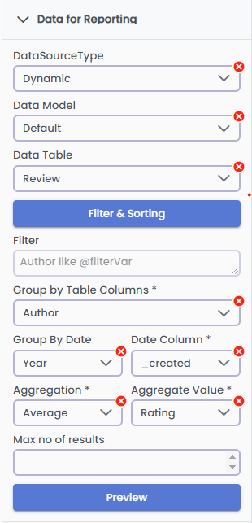
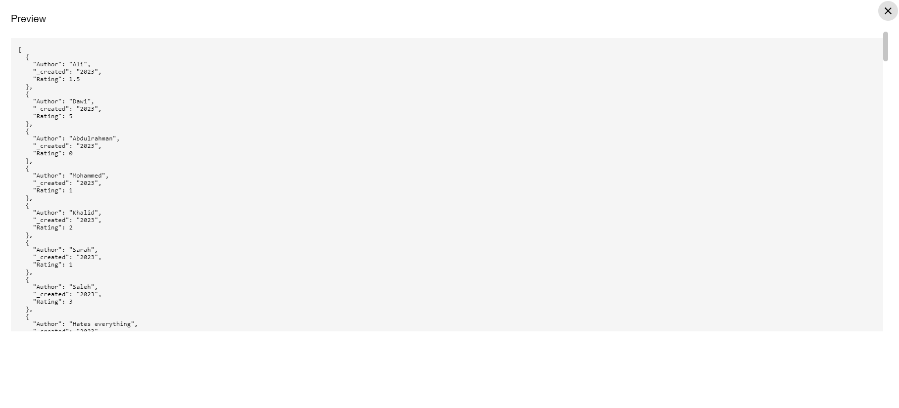
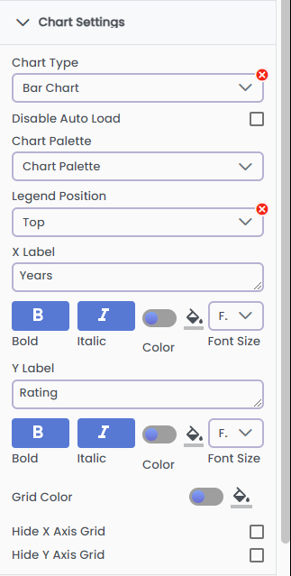
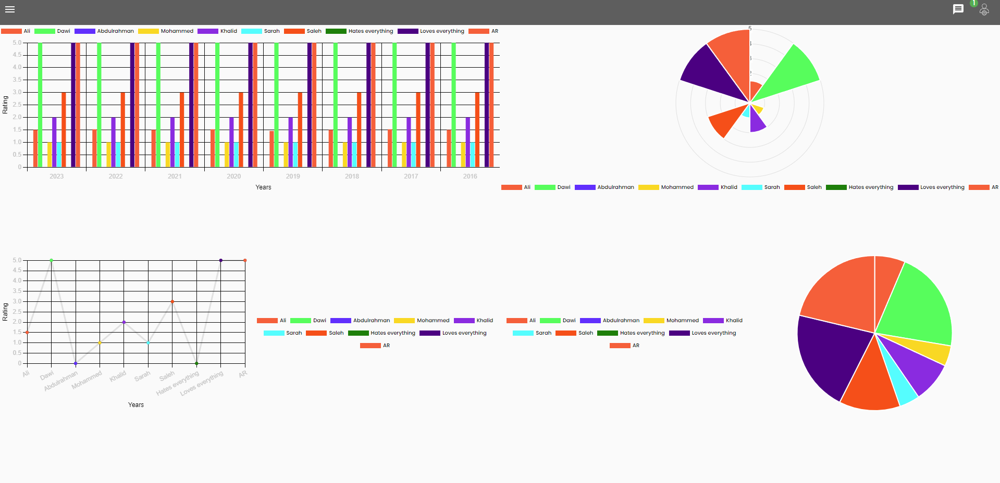

# Reporting

Welcome to the comprehensive guide for creating insightful reports in GA_Universe! This tutorial is designed to guide you through the process of transforming your data into meaningful reports that can drive decision-making. Whether you’re new to data analysis or looking to refine your reporting skills, this tutorial will provide you with the tools and knowledge needed to leverage GA_Universe's powerful reporting capabilities. Let's get started on your journey to mastering data reporting!

## Perquisites

Before we dive into the specifics, it’s important to note that this tutorial assumes you have already set up at least one data table in GA_Universe with numeric values suitable for aggregation. These data tables are the cornerstone of effective reporting, allowing you to explore trends, analyze performance, and uncover hidden insights in your data.

## Inserting the Simplified Reporting Control Element

The first step in creating your report in GA_Universe is to utilize the Simplified Reporting Control Element. This element is a key component for building intuitive and interactive charts. Here’s how to get started:

### Drag and Drop

Begin by locating the Simplified Reporting Control Element in your toolbox. Click and hold this element, then drag it onto your desired location on the page. This action integrates the element into your workspace.

### Accessing Properties

Once the element is placed on the page, click on it to reveal its properties. On the right side of your screen, you will notice two main sections:

- **Chart Settings**:
  - This section is your gateway to customization. Here, you can tailor the aesthetics and functionality of your chart. Explore various options like chart type (bar, line, pie, etc.), chart palette for color schemes, and other settings to fine-tune the appearance and behavior of your chart.
- **Data for Reporting**:
  - This critical area is where you connect your data to the chart. Select the appropriate data model and data table from your collection. This selection will determine the data that is aggregated and displayed in your chart. Make sure to choose the table that aligns with the insights you aim to showcase in your report.

By completing this first step, you have successfully initiated the process of creating a dynamic and informative chart in GA_Universe. This sets the foundation for further customization and analysis as you proceed through the tutorial.

## Live example

This example will guide you through creating a bar chart in GA_Universe that visualizes movie reviews by different authors over various years. Here’s how to set it up:

1. **Select the Data Source:** Begin by setting your data source to 'Dynamic'.
2. **Choose the Data Model and Table:** Next, we will select the appropriate data model within GA_Universe. For this example, we will choose the ‘Default’ data model, then choose the 'Reviews' data table, as it contains the information relevant to our  chart.
    - **Optional Utilize Filtering and Sorting:** You can apply the same filtering and sorting techniques as described in the [Data tutorial](./data.md) of GA_Universe.
3. **Grouping Data:**
    - **Primary Grouping (Author):** In the chart settings, find the option to group data and select 'Author' from the dropdown menu. This action groups your data based on the authors of the movie reviews.

    - **Secondary Grouping (Date):** Additionally, you can group by date to analyze the data over time. Select the 'Group by Date' option and choose year, then in the Date column select a date-type column from your data. This step will add a temporal dimension to your analysis.

4. **Select Aggregation Type and Value:** Decide on an aggregation method (like count, sum, average, etc.) and select the corresponding value to be aggregated. This setting determines how your data will be calculated and displayed in the chart.
5. **Max Number of Results (Optional):** If you want to limit the number of results displayed, enter an integer in the 'Max Number of Results' field. For this example, leave it blank to view all results.
6. **Preview the Chart:** Before finalizing, click on 'Preview' to view your chart. This feature allows you to see how your data is represented in the bar chart format and make any necessary adjustments before it is fully integrated into your report.
By following these steps, you create a dynamic bar chart that visually represents the frequency or nature of movie reviews by various authors across different years. This chart not only adds visual appeal to your report but also provides valuable insights briefly.

## Configuring the Chart Settings

After setting up your data source and grouping, the next step is to customize the chart settings to best represent your data. Here's how to configure these settings for your bar chart of movie reviews by authors over the years:

1. **Select Chart Type:** Choose 'Bar Chart' from the list of available chart types. This selection is ideal for comparing different groups of data, like authors in our example.
2. **Disable Auto Load Option:** Ensure that the 'Disable Auto Load' option remains unchecked. This setting allows your chart to update automatically without having to create a workflow that will load it.
3. **Choose Chart Palette:** If you have a predefined chart palette, select it here to apply specific color schemes to your chart. Since we don’t have a specific palette in this example, leave this option blank.
4. **Hide Legend Position:** Opt to hide the legend by disabling the legend position. This can help simplify the chart and focus attention on the data itself.
5. **Set Axis Labels:**
    - **X Label:** Enter 'Years' as the X-axis label. This label will represent the time dimension in your chart, helping viewers understand that the horizontal axis indicates different years.
    - **Y Label:** Enter 'Rating' as the Y-axis label. This label guides viewers to interpret the vertical axis as the rating values derived from your data.
6. **Preview the Chart:** As you adjust these settings, the data in the preview will automatically update to reflect these changes. This real-time preview helps you see how your chart is shaping up and allows for immediate adjustments as needed.

With these settings configured, your bar chart is now tailored to effectively display the distribution of movie review ratings by authors over the years. The automatic updates ensure that your chart remains current and relevant, offering a dynamic view of your data as it evolves.

### Preview of charts that can be created using the same data

## Conclusion

And that is it! Now you know how easy it is to use GA for creating reporting dashboards, for more information about the advanced reporting capabilities of GA_Universe, please read the tutorial about utilizing [GA_Analytics](./ga-analytics.md).
