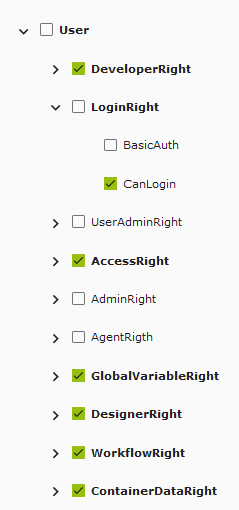

# Roles and Access

To have a truly secure application, GA offers different roles and access permissions and groups. These are all granular roles that can be customized by the user to allow complete access to who can see and do what on any page.

## Role Creation

1. Navigate to the User management in the settings section
2. Go to the roles tab
3. Go to the overview
4. Click the + Create New button in the left corner of the page
5. Name your role
6. The 2 options you have here are:
   - Administrator, this means your role has access to everything and has all the permissions. This is akin to the initial admin role.
   - Everyone, this applies this role to every user you have. This is good if you want to have common permission on your users.

Now you have created a role, time to assign permissions to it

## Managing Permissions

Navigate to the previously created role, the following tabs can be found:

- Permissions, in this tab you can give your users which permissions they need to login, edit, or access settings
- Layout, from this tab you can give the user access to different pages, or even to see or interact with different elements of these pages
- Container, this tab gives your user access to which data models and the ability to edit it and so on

To get more information about each tab please refer to the documentation.

For this example, we will give our newly created role the ability to edit pages and for that we will go to the permissions tab.

This essentially gives the user the ability to open the Appbuilder and make changes to the pages. But, if you want a full list of the permissions and what do, they mean please refer to the documentation

Now you have to assign the role to the user:

1. Navigate to the User management in the settings section
2. Go to the user tab
3. Select a user that was created already
4. Select the roles tab
5. Give it the needed role. For this example, will give it the role created earlier
6. Then you can sign in and use your new access
