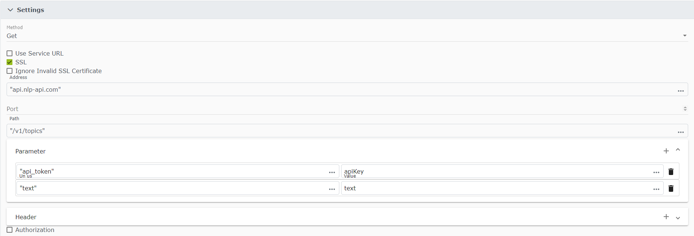

# Workflows

Workflows are the functionality of the page. They are designed as no code components, coding can be added for specific functions using the Workflow Block (WFB) Execute Script.

Workflows can be activated using page events, elements events, or based on scheduler triggers.

## Service Side

To use service side workflow block, please navigate to the data data section in the settings area and then select workflows followed bed service side workflows.

In this example we will be creating a workflow that sends an API request to an [API](https://www.nlp-api.com/) used for topic tagging. For this example we assume an email server has already been set.

1. Drop a "Define Values" WFB, and assign the following values which are needed
   - API key which you can get when registering at the [API website](https://www.nlp-api.com/)
   - Text you want analyzed
2. Drop the REST Call with the following parameters
    

   

   

3. Set the Success output as a status using the "Set Status" WFB
4. Drop a "Send Email" WFB, assign the email address you want it to be sent to. Remember to use double quotation marks ("") for the email address, and assign the email API output that we assigned to the status as the body of the email

That's it, run it and wait for the email to be sent!

> Note: All changes made are saved locally on your account, and are not visible to the all other users. To make them visible to all users please accept the changes in the ChangeLog Overview in the settings

## Client Side

Here is an example where client side workflows are used to read the value of a textbox and display value as a message to the user

1. Navigate to a page, and open the app builder

   > Note: When you open the AppBuilder, please select edit mode and not view mode. When you select the edit mode the page becomes locked and you are the only one allowed to change it until the changes are accepted in the ChangeLog.

2. Modify the base grid's properties, and change the row definition to add a new row and column
3. Add a textbox in the first row and first column and modify it's properties to make it editable. You can also change how the elements look and customize them to your liking
4. Add a button in the first row, second column
5. Create the workflow by navigating to the workflow tab and clicking the + button
6. Once inside the workflow editor:
7. Drop a read values WFB from the layout category
8. Choose the textbox element and assign it a status key (Status keys are like a local variable for the workflow)
9. Save the WFB
10. Drop a show message block from the actions category
11. Modify the block properties to show the status key assigned earlier (Text needs to be inside quotation marks "", status keys don't need to be inside quotation marks)
12. Name the workflow and save it

<video controls="controls">
  <source src="/img/tut3-2.mov" />
</video>

13. Click on the button in the first row, second column, navigate to the element events tab, toggle the mouseClick event and bind it to the previously created workflow

<video controls="controls">
  <source src="/img/tut3-3.mov" />
</video>

14. Save the app and close the AppBuilder

Now try it out! Add text in the textbox and click on the button, and a message box with your text should pop out.

<video controls="controls">
  <source src="/img/tut3-4.mov" />
</video>

You can explore and try different things in the workflow editor! Try to create a similar workflow that validates if input equals to a certain value and print a specific message respectively (Hint: use DataSwitch WFB)

> Note: All changes made are saved locally on your account, and are not visible to the all other users. To make them visible to all users please accept the changes in the ChangeLog Overview in the settings.
